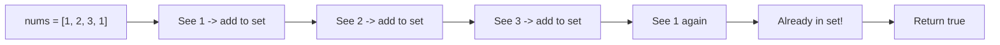

# 1. Contains Duplicate

## Problem

Given an integer array `nums`, determine whether any value appears at least twice in the array. Return `true` if a duplicate exists, and `false` if every element is unique.

## Example 1

### Input

```text
nums = [1, 2, 3, 1]
```

### Expected Output

```text
true
```

### Explanation

The value 1 appears twice, so the array has a duplicate.

## Example 2

### Input

```text
nums = [1, 2, 3, 4]
```

### Expected Output

```text
false
```

### Explanation

All values are different, so there is no duplicate.

## How to Solve

### Key Idea

Use a set to remember which numbers you have already seen while scanning the array once.

### Approach

1. Create an empty set to store numbers we've seen.
2. Loop through each number in the array.
3. If the number is already in the set, return `true` immediately.
4. Otherwise, add the number to the set and keep going.
5. If the loop finishes without finding a repeat, return `false`.

### Why It Works

A set lookup is very fast (constant time on average), so checking "have I seen this before?" for every element only costs a little extra memory but saves us from comparing every pair of numbers.

## Visual Explanation



## Optimal Solution

```python
class Solution:
    def containsDuplicate(self, nums: list[int]) -> bool:
        seen = set()
        for num in nums:
            if num in seen:
                return True
            seen.add(num)
        return False
```

## Complexity

- **Time:** O(n)
- **Space:** O(n)

## Real-World Uses

- Detecting duplicate records during a database or CSV import before insertion.
- Rejecting duplicate form submissions using a set of recently seen request IDs.
- Deduplicating a dataset or log stream before further processing.

## Key Takeaway

Whenever you need to check "have I seen this value before?", a hash set is usually the fastest tool, turning an O(n^2) brute-force comparison into a single O(n) pass.
