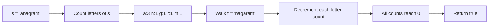

# 2. Valid Anagram

## Problem

Given two strings `s` and `t`, determine whether `t` is an anagram of `s`. An anagram means `t` uses exactly the same letters as `s`, the same number of times, just possibly in a different order.

## Example 1

### Input

```text
s = "anagram", t = "nagaram"
```

### Expected Output

```text
true
```

### Explanation

Both strings contain the exact same letters with the same counts, just rearranged.

## Example 2

### Input

```text
s = "rat", t = "car"
```

### Expected Output

```text
false
```

### Explanation

"rat" and "car" do not have the same letters, so they are not anagrams.

## How to Solve

### Key Idea

Count how many times each character appears in both strings and compare the counts.

### Approach

1. If the two strings have different lengths, return `false` right away.
2. Build a count of each character in `s` using a hash map (or fixed-size array for lowercase letters).
3. Walk through `t`, decreasing the count for each character it contains.
4. If any character's count goes negative or `t` has a character not in `s`, return `false`.
5. If all counts balance out to zero, return `true`.

### Why It Works

Two strings are anagrams exactly when every character appears the same number of times in both. Counting characters once and comparing is much faster than trying every rearrangement.

## Visual Explanation



## Optimal Solution

```python
class Solution:
    def isAnagram(self, s: str, t: str) -> bool:
        if len(s) != len(t):
            return False

        counts = {}
        for ch in s:
            counts[ch] = counts.get(ch, 0) + 1

        for ch in t:
            if ch not in counts:
                return False
            counts[ch] -= 1
            if counts[ch] == 0:
                del counts[ch]

        return len(counts) == 0
```

## Complexity

- **Time:** O(n)
- **Space:** O(1) (at most 26 letters if limited to lowercase English letters; O(n) in general)

## Real-World Uses

- Detecting plagiarism-lite cases where text is rearranged but uses the same words/letters.
- Validating that a shuffled password or code input matches an expected character set.
- Grouping product names or SKUs that differ only in character order in a catalog cleanup.

## Key Takeaway

Character (or element) frequency counting with a hash map is a go-to pattern for comparing two collections regardless of order.
