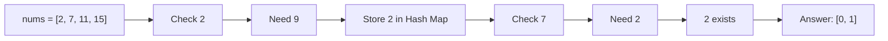

# 3. Two Sum

## Problem

Given an array of integers `nums` and an integer `target`, find the indices of two different elements that add up to `target`. Assume exactly one valid answer exists, and you cannot use the same element twice.

## Example 1

### Input

```text
nums = [2, 7, 11, 15], target = 9
```

### Expected Output

```text
[0, 1]
```

### Explanation

nums[0] + nums[1] = 2 + 7 = 9.

## Example 2

### Input

```text
nums = [3, 2, 4], target = 6
```

### Expected Output

```text
[1, 2]
```

### Explanation

nums[1] + nums[2] = 2 + 4 = 6.

## How to Solve

### Key Idea

While scanning the array, remember the numbers you've already seen and the complement needed to reach the target.

### Approach

1. Create an empty hash map that maps a number to its index.
2. For each number in the array, compute `complement = target - number`.
3. If `complement` is already in the map, return its index and the current index.
4. Otherwise, store the current number and its index in the map.
5. Continue until the pair is found.

### Why It Works

Instead of checking every pair of numbers (which is slow), we ask "have I already seen the number that would complete this pair?" using a hash map lookup, which is fast and only requires one pass through the array.

## Visual Explanation



## Optimal Solution

```python
class Solution:
    def twoSum(self, nums: list[int], target: int) -> list[int]:
        seen = {}
        for i, num in enumerate(nums):
            complement = target - num
            if complement in seen:
                return [seen[complement], i]
            seen[num] = i
        return []
```

## Complexity

- **Time:** O(n)
- **Space:** O(n)

## Real-World Uses

- Matching transactions that sum to a target amount during payment reconciliation.
- Finding pairs of items whose combined price fits a budget in an e-commerce bundling feature.
- Pairing sensor readings or offsets that must cancel out to a target value in calibration checks.

## Key Takeaway

When you need to find pairs that satisfy some condition, storing "value -> index" in a hash map lets you check for the needed partner in constant time instead of nested loops.
