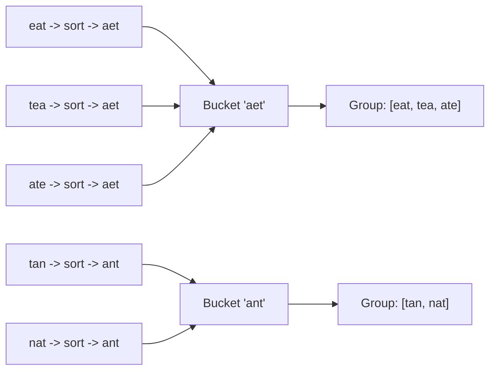

# 4. Group Anagrams

## Problem

Given a list of strings `strs`, group together all strings that are anagrams of each other. You can return the groups in any order.

## Example 1

### Input

```text
strs = ["eat", "tea", "tan", "ate", "nat", "bat"]
```

### Expected Output

```text
[["eat","tea","ate"], ["tan","nat"], ["bat"]]
```

### Explanation

"eat", "tea", and "ate" use the same letters. "tan" and "nat" use the same letters. "bat" has no match.

## Example 2

### Input

```text
strs = [""]
```

### Expected Output

```text
[[""]]
```

### Explanation

A single empty string forms its own group.

## How to Solve

### Key Idea

Anagrams share the same letters, so if you sort the letters of each string, all anagrams produce the identical sorted string, which can be used as a grouping key.

### Approach

1. Create a hash map from a "key" to a list of strings.
2. For each string, sort its characters to build the key (e.g. "eat" -> "aet").
3. Append the original string to the list stored under that key.
4. After processing all strings, return all the lists in the hash map as the groups.

### Why It Works

Two strings are anagrams exactly when their sorted character sequences are equal. Using the sorted string as a hash map key automatically clusters all matching strings together.

## Visual Explanation



## Optimal Solution

```python
from collections import defaultdict

class Solution:
    def groupAnagrams(self, strs: list[str]) -> list[list[str]]:
        groups = defaultdict(list)
        for s in strs:
            key = "".join(sorted(s))
            groups[key].append(s)
        return list(groups.values())
```

## Complexity

- **Time:** O(n * k log k), where n is the number of strings and k is the max string length (sorting each string)
- **Space:** O(n * k)

## Real-World Uses

- Clustering misspelled or reordered tags/keywords into canonical groups for search indexing.
- Grouping DNA or protein fragments that share the same composition in bioinformatics pipelines.
- Detecting near-duplicate product listings that use the same words in different order.

## Key Takeaway

When items need to be grouped by some "shape" they share, transform each item into a canonical key (like sorted characters) and use a hash map to bucket them together.
