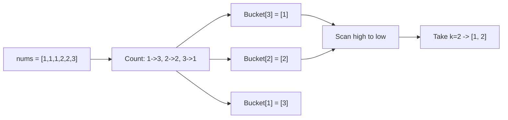

# 5. Top K Frequent Elements

## Problem

Given an integer array `nums` and an integer `k`, return the `k` most frequently occurring elements. You may return the answer in any order.

## Example 1

### Input

```text
nums = [1, 1, 1, 2, 2, 3], k = 2
```

### Expected Output

```text
[1, 2]
```

### Explanation

1 appears 3 times and 2 appears 2 times, making them the two most frequent values.

## Example 2

### Input

```text
nums = [1], k = 1
```

### Expected Output

```text
[1]
```

### Explanation

1 is the only element, so it is the most frequent by default.

## How to Solve

### Key Idea

Count how often each number appears, then use bucket sort by frequency so you can grab the top k without a full sort.

### Approach

1. Count the frequency of every number using a hash map.
2. Create a list of buckets where the index represents a frequency (from 0 to n), and each bucket holds numbers that occur that many times.
3. Walk the buckets from highest frequency down to lowest, collecting numbers.
4. Stop as soon as you have collected k numbers.

### Why It Works

Since frequency can never exceed the length of the array, bucket sort lets us group numbers by frequency in linear time instead of paying the O(n log n) cost of a general sort.

## Visual Explanation



## Optimal Solution

```python
class Solution:
    def topKFrequent(self, nums: list[int], k: int) -> list[int]:
        count = {}
        for num in nums:
            count[num] = count.get(num, 0) + 1

        buckets = [[] for _ in range(len(nums) + 1)]
        for num, freq in count.items():
            buckets[freq].append(num)

        result = []
        for freq in range(len(buckets) - 1, 0, -1):
            for num in buckets[freq]:
                result.append(num)
                if len(result) == k:
                    return result

        return result
```

## Complexity

- **Time:** O(n)
- **Space:** O(n)

## Real-World Uses

- Finding the most-viewed articles or products from a stream of interaction logs.
- Computing trending hashtags or search terms over a time window.
- Identifying the most frequent error codes in a monitoring system to prioritize fixes.

## Key Takeaway

Bucket sort is a great trick whenever you need to rank items by a count that is bounded by the input size, avoiding an unnecessary full sort.
