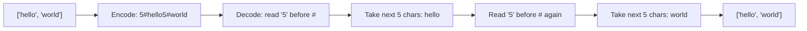

# 6. Encode and Decode Strings

## Problem

Design an algorithm to encode a list of strings into a single string, and a corresponding algorithm to decode that single string back into the original list of strings. The strings may contain any characters, including special symbols and delimiters.

## Example 1

### Input

```text
strs = ["hello", "world"]
```

### Expected Output

```text
["hello", "world"]
```

### Explanation

Encoding "hello" and "world" and then decoding the result returns the original list.

## Example 2

### Input

```text
strs = ["it's:me", ""]
```

### Expected Output

```text
["it's:me", ""]
```

### Explanation

Even with special characters like colons and an empty string, the encode/decode pair must reconstruct the original list exactly.

## How to Solve

### Key Idea

Store the length of each string before the string itself, so the decoder always knows exactly how many characters to read next, no matter what characters the string contains.

### Approach

1. To encode: for each string, write its length, then a special separator character (like `#`), then the string itself. Concatenate all of these together.
2. To decode: scan through the encoded string. At each position, read digits until the `#` separator to get the length of the next string.
3. Use that length to read exactly that many characters as the next original string.
4. Move the pointer past those characters and repeat until the whole encoded string is consumed.

### Why It Works

Because we explicitly store the length before each string, we never need to search for a delimiter inside the string itself. This means the strings can contain any characters, including the separator, without breaking the decoding.

## Visual Explanation



## Optimal Solution

```python
class Codec:
    def encode(self, strs: list[str]) -> str:
        encoded = ""
        for s in strs:
            encoded += str(len(s)) + "#" + s
        return encoded

    def decode(self, s: str) -> list[str]:
        result = []
        i = 0
        while i < len(s):
            j = i
            while s[j] != "#":
                j += 1
            length = int(s[i:j])
            start = j + 1
            end = start + length
            result.append(s[start:end])
            i = end
        return result
```

## Complexity

- **Time:** O(n), where n is the total number of characters across all strings
- **Space:** O(n) for the encoded string

## Real-World Uses

- Serializing a list of fields into a single value for network protocols or message queues.
- Implementing custom binary/text file formats where fields must survive arbitrary content.
- Packing variable-length strings into a cache value or database column that stores raw bytes.

## Key Takeaway

When you need a delimiter-safe serialization format, prefix each chunk with its length instead of relying on a separator character that might collide with the data itself.
