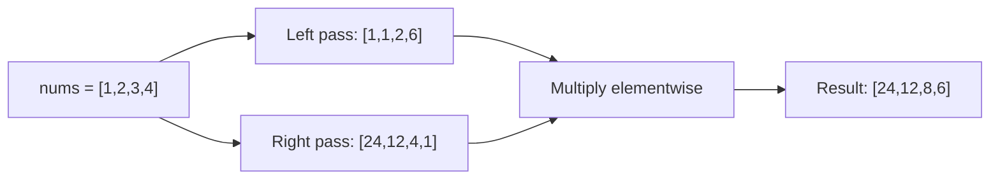

# 7. Product of Array Except Self

## Problem

Given an integer array `nums`, return a new array `answer` where `answer[i]` is the product of all the elements of `nums` except `nums[i]`. You must solve it without using the division operator.

## Example 1

### Input

```text
nums = [1, 2, 3, 4]
```

### Expected Output

```text
[24, 12, 8, 6]
```

### Explanation

For index 0: 2*3*4=24. For index 1: 1*3*4=12. For index 2: 1*2*4=8. For index 3: 1*2*3=6.

## Example 2

### Input

```text
nums = [-1, 1, 0, -3, 3]
```

### Expected Output

```text
[0, 0, 9, 0, 0]
```

### Explanation

Because one element is 0, every product except the one at index 2 (where the zero itself lives) becomes 0.

## How to Solve

### Key Idea

For each position, the answer is "the product of everything to its left" multiplied by "the product of everything to its right." Compute those two passes separately.

### Approach

1. Create a result array. Fill it so that `result[i]` holds the product of all elements to the left of index `i` (a left-to-right pass, starting with 1).
2. Do a second pass from right to left, keeping a running product of everything seen so far on the right.
3. Multiply `result[i]` by this running right product at each step, then update the running right product.
4. The result array now holds the answer without ever using division.

### Why It Works

Any element's "product except self" is exactly the left-side product times the right-side product. By building the left products first and then folding in the right products in a second pass, we only need two linear scans and no division.

## Visual Explanation



## Optimal Solution

```python
class Solution:
    def productExceptSelf(self, nums: list[int]) -> list[int]:
        n = len(nums)
        result = [1] * n

        left_product = 1
        for i in range(n):
            result[i] = left_product
            left_product *= nums[i]

        right_product = 1
        for i in range(n - 1, -1, -1):
            result[i] *= right_product
            right_product *= nums[i]

        return result
```

## Complexity

- **Time:** O(n)
- **Space:** O(1) extra space (not counting the output array)

## Real-World Uses

- Computing per-item discount totals where each item's share excludes itself, like splitting a group bill.
- Sensitivity analysis in spreadsheets: how a total changes if one input is removed.
- Normalizing scores in a dataset relative to all other entries without recomputing full products/sums each time.

## Key Takeaway

The "prefix and suffix product" pattern lets you avoid division while still computing per-element products in linear time — a useful trick whenever a value depends on "everything except me."
