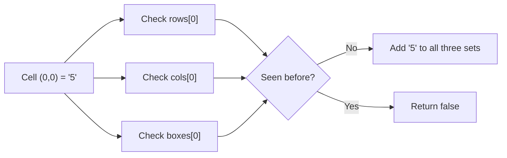

# 8. Valid Sudoku

## Problem

Given a 9x9 Sudoku board partially filled in, determine whether it is valid so far. A board is valid if each row, each column, and each of the nine 3x3 sub-boxes contains no repeated digits (1-9). Empty cells are marked with `'.'` and are ignored — the board does not need to be fully solved or solvable, just consistent with the rules so far.

## Example 1

### Input

```text
board = [
  ["5","3",".",".","7",".",".",".","."],
  ["6",".",".","1","9","5",".",".","."],
  [".","9","8",".",".",".",".","6","."],
  ["8",".",".",".","6",".",".",".","3"],
  ["4",".",".","8",".","3",".",".","1"],
  ["7",".",".",".","2",".",".",".","6"],
  [".","6",".",".",".",".","2","8","."],
  [".",".",".","4","1","9",".",".","5"],
  [".",".",".",".","8",".",".","7","9"]
]
```

### Expected Output

```text
true
```

### Explanation

No row, column, or 3x3 box has a repeated digit among the filled cells.

## Example 2

### Input

```text
board = [
  ["8","3",".",".","7",".",".",".","."],
  ["6",".",".","1","9","5",".",".","."],
  [".","9","8",".",".",".",".","6","."],
  ["8",".",".",".","6",".",".",".","3"],
  ["4",".",".","8",".","3",".",".","1"],
  ["7",".",".",".","2",".",".",".","6"],
  [".","6",".",".",".",".","2","8","."],
  [".",".",".","4","1","9",".",".","5"],
  [".",".",".",".","8",".",".","7","9"]
]
```

### Expected Output

```text
false
```

### Explanation

The top-left 3x3 box now contains two 8s (row 0 and row 3), which breaks the rule.

## How to Solve

### Key Idea

Track which digits have already been seen in each row, each column, and each 3x3 box using sets, and check for repeats as you scan the board once.

### Approach

1. Create three collections of sets: one set per row, one set per column, and one set per 3x3 box (9 of each).
2. Loop through every cell on the board. Skip cells that are `'.'`.
3. For a filled cell, figure out which row set, column set, and box set it belongs to (the box index can be computed as `(row // 3) * 3 + (col // 3)`).
4. If the digit is already in any of those three sets, the board is invalid — return `false`.
5. Otherwise, add the digit to all three sets and continue. If the loop finishes, return `true`.

### Why It Works

Checking membership in a set is fast, so verifying "have I already placed this digit in this row/column/box?" for every filled cell only takes one pass over the 81 cells.

## Visual Explanation



## Optimal Solution

```python
from collections import defaultdict

class Solution:
    def isValidSudoku(self, board: list[list[str]]) -> bool:
        rows = defaultdict(set)
        cols = defaultdict(set)
        boxes = defaultdict(set)

        for r in range(9):
            for c in range(9):
                val = board[r][c]
                if val == ".":
                    continue

                box_id = (r // 3) * 3 + (c // 3)

                if val in rows[r] or val in cols[c] or val in boxes[box_id]:
                    return False

                rows[r].add(val)
                cols[c].add(val)
                boxes[box_id].add(val)

        return True
```

## Complexity

- **Time:** O(1) technically, since the board is always 9x9 (equivalently O(n^2) for an n x n board)
- **Space:** O(1) for a fixed 9x9 board (equivalently O(n^2) in general)

## Real-World Uses

- Validating constraint rules in spreadsheet or grid-based configuration tools (no duplicate values per row/column/group).
- Checking scheduling conflicts where a resource can't be double-booked in overlapping groupings (time slot, room, team).
- Verifying uniqueness constraints across multiple overlapping dimensions in data validation pipelines.

## Key Takeaway

When you need to detect duplicates across several overlapping groupings (rows, columns, and boxes here), keep one hash set per group and check all relevant groups in a single pass.
