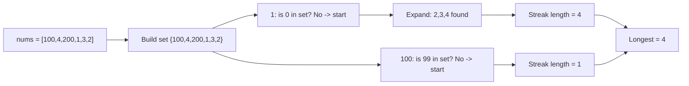

# 9. Longest Consecutive Sequence

## Problem

Given an unsorted array of integers `nums`, return the length of the longest sequence of consecutive integers (numbers that follow each other with no gaps, like 3, 4, 5, 6). The array is not sorted, and you should solve it in O(n) time.

## Example 1

### Input

```text
nums = [100, 4, 200, 1, 3, 2]
```

### Expected Output

```text
4
```

### Explanation

The longest consecutive sequence is 1, 2, 3, 4, which has length 4.

## Example 2

### Input

```text
nums = [0, 3, 7, 2, 5, 8, 4, 6, 0, 1]
```

### Expected Output

```text
9
```

### Explanation

The longest consecutive sequence is 0, 1, 2, 3, 4, 5, 6, 7, 8, which has length 9.

## How to Solve

### Key Idea

Put all numbers in a set for instant lookups, then only start counting a sequence from numbers that are the beginning of a sequence (numbers whose `number - 1` is not in the set).

### Approach

1. Add all numbers into a set to remove duplicates and allow O(1) lookups.
2. For each number in the set, check whether `number - 1` exists in the set.
3. If it does, this number is in the middle of a sequence, so skip it (it will be counted starting from its true beginning).
4. If `number - 1` does not exist, this number starts a new sequence. Keep checking `number + 1`, `number + 2`, and so on, counting how long the streak goes.
5. Keep track of the longest streak found across all starting points.

### Why It Works

By only expanding sequences from their true starting point, each number is visited at most twice overall (once to check if it's a start, and once while extending a streak), keeping the whole algorithm linear instead of resorting to sorting or repeated searches.

## Visual Explanation



## Optimal Solution

```python
class Solution:
    def longestConsecutive(self, nums: list[int]) -> int:
        num_set = set(nums)
        longest = 0

        for num in num_set:
            if num - 1 not in num_set:
                length = 1
                while num + length in num_set:
                    length += 1
                longest = max(longest, length)

        return longest
```

## Complexity

- **Time:** O(n)
- **Space:** O(n)

## Real-World Uses

- Finding the longest run of consecutive days a user was active from a log of timestamps.
- Detecting contiguous ranges of allocated IDs or ports in a resource management system.
- Identifying the longest streak of consecutive version numbers or sequence IDs in a data integrity check.

## Key Takeaway

Using a hash set for O(1) lookups and only expanding a streak from its true starting element is a classic way to solve "consecutive run" problems in linear time without sorting.
