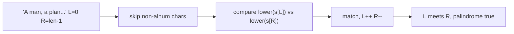

# 10. Valid Palindrome

## Problem

Given a string, check if it reads the same forwards and backwards after you ignore anything that is not a letter or number, and ignore uppercase vs lowercase. Return true if it's a palindrome, false otherwise.

## Example 1

### Input

```text
s = "A man, a plan, a canal: Panama"
```

### Expected Output

```text
true
```

### Explanation

Ignoring punctuation, spaces, and case, the cleaned string is "amanaplanacanalpanama", which is the same forwards and backwards.

## Example 2

### Input

```text
s = "race a car"
```

### Expected Output

```text
false
```

### Explanation

Cleaned string is "raceacar", which is not the same reversed, so it's not a palindrome.

## How to Solve

### Key Idea

Use two pointers, one starting at the left end and one at the right end, and move them toward each other while skipping characters that aren't letters or digits.

### Approach

1. Set `left` to 0 and `right` to the last index of the string.
2. While `left < right`: skip `left` forward if it's not alphanumeric, skip `right` backward if it's not alphanumeric.
3. Compare the lowercase versions of `s[left]` and `s[right]`. If they differ, return false. Otherwise move both pointers inward and repeat.
4. If the loop finishes without mismatches, return true.

### Why It Works

Any true palindrome matches character by character from the outside in. By skipping non-alphanumeric characters as we go, we effectively compare only the meaningful characters without building a new cleaned string.

## Visual Explanation



## Optimal Solution

```python
class Solution:
    def isPalindrome(self, s: str) -> bool:
        left, right = 0, len(s) - 1

        while left < right:
            while left < right and not s[left].isalnum():
                left += 1
            while left < right and not s[right].isalnum():
                right -= 1

            if s[left].lower() != s[right].lower():
                return False

            left += 1
            right -= 1

        return True
```

## Complexity

- **Time:** O(n) — each character is visited at most once by the two pointers.
- **Space:** O(1) — only a couple of index variables are used.

## Real-World Uses

- Validating and normalizing user input, such as ignoring formatting characters when checking phone numbers or codes.
- Text-cleaning pipelines that compare content while ignoring punctuation, spacing, or case.
- DNA/sequence symmetry checks in bioinformatics tools.

## Key Takeaway

The two-pointer pattern lets you check a condition from both ends of a sequence at once, avoiding the need to build a separate cleaned-up copy of the data.
