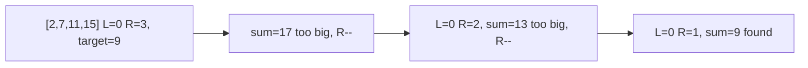

# 11. Two Sum II - Input Array Is Sorted

## Problem

You are given a sorted array of integers (ascending order) and a target number. Find two numbers in the array that add up to the target, and return their 1-indexed positions. There is exactly one valid answer, and you cannot use the same element twice.

## Example 1

### Input

```text
numbers = [2, 7, 11, 15], target = 9
```

### Expected Output

```text
[1, 2]
```

### Explanation

numbers[0] + numbers[1] = 2 + 7 = 9, so the 1-indexed positions are 1 and 2.

## Example 2

### Input

```text
numbers = [2, 3, 4], target = 6
```

### Expected Output

```text
[1, 3]
```

### Explanation

numbers[0] + numbers[2] = 2 + 4 = 6, so the 1-indexed positions are 1 and 3.

## How to Solve

### Key Idea

Since the array is already sorted, put one pointer at the start and one at the end, then move them toward each other based on whether the current sum is too big or too small.

### Approach

1. Set `left = 0` and `right = len(numbers) - 1`.
2. Compute `current_sum = numbers[left] + numbers[right]`.
3. If `current_sum == target`, return `[left + 1, right + 1]`. If it's too small, move `left` forward. If it's too large, move `right` backward. Repeat until found.

### Why It Works

Because the array is sorted, increasing `left` only increases the sum, and decreasing `right` only decreases the sum. This lets you narrow down the correct pair without checking every combination.

## Visual Explanation



## Optimal Solution

```python
class Solution:
    def twoSum(self, numbers: list[int], target: int) -> list[int]:
        left, right = 0, len(numbers) - 1

        while left < right:
            current_sum = numbers[left] + numbers[right]

            if current_sum == target:
                return [left + 1, right + 1]
            elif current_sum < target:
                left += 1
            else:
                right -= 1

        return []
```

## Complexity

- **Time:** O(n) — the pointers move toward each other at most n times total.
- **Space:** O(1) — no extra data structures needed.

## Real-World Uses

- Matching pairs of transactions or values that must sum to a target, such as reconciling accounts.
- Finding complementary price points in sorted pricing or inventory data.
- Query optimization over sorted indexes where a range narrows from both ends.

## Key Takeaway

When an array is sorted, two pointers moving inward from both ends can find a target pair in linear time, much faster than checking every pair.
