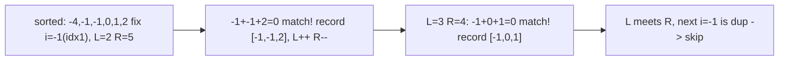

# 12. 3Sum

## Problem

Given an integer array, find all unique triples of numbers that add up to zero. Each triple should be a list of three numbers, and the same triple (in any order) should not appear more than once in the result.

## Example 1

### Input

```text
nums = [-1, 0, 1, 2, -1, -4]
```

### Expected Output

```text
[[-1, -1, 2], [-1, 0, 1]]
```

### Explanation

These are the only two unique groups of three numbers from the array that sum to 0. Order of triples/output does not matter.

## Example 2

### Input

```text
nums = [0, 1, 1]
```

### Expected Output

```text
[]
```

### Explanation

No three numbers in this array add up to 0.

## How to Solve

### Key Idea

Sort the array first, then fix one number at a time and use the two-pointer technique on the rest of the array to find pairs that complete the sum to zero.

### Approach

1. Sort `nums` in ascending order.
2. Loop through each index `i`, treating `nums[i]` as the first number of the triple (skip duplicate values of `nums[i]` to avoid repeat triples).
3. Use two pointers `left = i + 1` and `right = len(nums) - 1` to find pairs where `nums[i] + nums[left] + nums[right] == 0`, moving pointers inward and skipping duplicates when a match is found.

### Why It Works

Sorting lets us use two pointers to search for a pair summing to a specific value in linear time, and fixing one element at a time reduces the 3-number search down to the well-known 2-sum-on-sorted-array pattern. Skipping duplicates at each level avoids repeated triples.

## Visual Explanation



## Optimal Solution

```python
class Solution:
    def threeSum(self, nums: list[int]) -> list[list[int]]:
        nums.sort()
        result = []
        n = len(nums)

        for i in range(n - 2):
            if i > 0 and nums[i] == nums[i - 1]:
                continue
            if nums[i] > 0:
                break

            left, right = i + 1, n - 1

            while left < right:
                total = nums[i] + nums[left] + nums[right]

                if total == 0:
                    result.append([nums[i], nums[left], nums[right]])
                    left += 1
                    right -= 1
                    while left < right and nums[left] == nums[left - 1]:
                        left += 1
                    while left < right and nums[right] == nums[right + 1]:
                        right -= 1
                elif total < 0:
                    left += 1
                else:
                    right -= 1

        return result
```

## Complexity

- **Time:** O(n^2) — sorting is O(n log n), and for each element we run a two-pointer scan of O(n).
- **Space:** O(1) or O(n) depending on sort implementation, not counting the output list.

## Real-World Uses

- Combinatorial search problems like finding groups of items (prices, weights) that balance to a target.
- Portfolio or budget allocation where combinations of values must net to zero or a threshold.
- Deduplicated candidate generation in constraint-solving and recommendation systems.

## Key Takeaway

Sorting plus two pointers turns an expensive brute-force triple search into a much faster approach, and careful duplicate-skipping is key to getting unique results.
