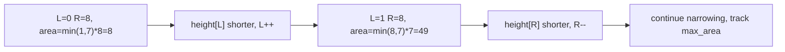

# 13. Container With Most Water

## Problem

You are given an array of heights, where each value represents a vertical line at that position. Pick two lines so that, together with the x-axis, they form a container, and find the maximum amount of water it can hold. The water held is limited by the shorter of the two lines.

## Example 1

### Input

```text
height = [1, 8, 6, 2, 5, 4, 8, 3, 7]
```

### Expected Output

```text
49
```

### Explanation

The lines at index 1 (height 8) and index 8 (height 7) are 7 units apart, and the shorter line has height 7, giving an area of 7 * 7 = 49, which is the maximum possible.

## Example 2

### Input

```text
height = [1, 1]
```

### Expected Output

```text
1
```

### Explanation

Only one pair is possible: both lines have height 1 and are 1 unit apart, giving an area of 1 * 1 = 1.

## How to Solve

### Key Idea

Start with the widest possible container (the two ends of the array) and shrink inward, always moving the pointer at the shorter line, since that's the only move that could possibly increase the area.

### Approach

1. Set `left = 0` and `right = len(height) - 1`, and track `max_area = 0`.
2. Compute the area as `min(height[left], height[right]) * (right - left)` and update `max_area` if it's bigger.
3. Move the pointer pointing to the shorter line inward (if `height[left] < height[right]`, do `left += 1`, else `right -= 1`). Repeat until `left == right`.

### Why It Works

The area is limited by the shorter line and the distance between the two lines. If you move the taller line's pointer inward, the width shrinks and the height stays capped by the same short line, so the area can only get worse or stay the same. Moving the shorter line's pointer is the only choice that gives a chance at a taller limiting height, potentially increasing the area.

## Visual Explanation



## Optimal Solution

```python
class Solution:
    def maxArea(self, height: list[int]) -> int:
        left, right = 0, len(height) - 1
        max_area = 0

        while left < right:
            current_area = min(height[left], height[right]) * (right - left)
            max_area = max(max_area, current_area)

            if height[left] < height[right]:
                left += 1
            else:
                right -= 1

        return max_area
```

## Complexity

- **Time:** O(n) — each pointer moves inward at most n times total.
- **Space:** O(1) — only a few variables are used.

## Real-World Uses

- Resource allocation problems where capacity is limited by the smaller of two constraints, like pairing warehouse bins.
- Optimizing container/tank layouts in logistics and manufacturing planning.
- Bandwidth or throughput matching between two endpoints with differing capacities.

## Key Takeaway

Two pointers starting at opposite ends, with a rule for which one to move, can find an optimal pair without checking all n^2 combinations — always move the pointer that's limiting your result.
