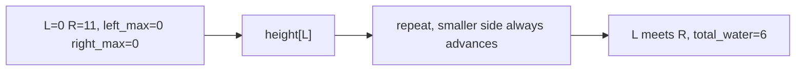

# 14. Trapping Rain Water

## Problem

You are given an array of non-negative integers representing an elevation map, where each value is the height of a bar of width 1. Calculate how much rainwater can be trapped between the bars after it rains.

## Example 1

### Input

```text
height = [0, 1, 0, 2, 1, 0, 1, 3, 2, 1, 2, 1]
```

### Expected Output

```text
6
```

### Explanation

Water settles into the dips between taller bars; adding up all the trapped water across the map gives a total of 6 units.

## Example 2

### Input

```text
height = [4, 2, 0, 3, 2, 5]
```

### Expected Output

```text
9
```

### Explanation

The tall bars on both sides trap water over the lower bars in between, totaling 9 units.

## How to Solve

### Key Idea

The water trapped at any position is limited by the shorter of the tallest bar to its left and the tallest bar to its right. Use two pointers moving inward, always processing the side with the smaller "tallest so far" value, since that's the side whose water level is already determined.

### Approach

1. Set `left = 0`, `right = len(height) - 1`, `left_max = 0`, `right_max = 0`, and `total_water = 0`.
2. While `left < right`, compare `height[left]` and `height[right]`.
3. If `height[left] < height[right]`: update `left_max` to the max of itself and `height[left]`, add `left_max - height[left]` to `total_water`, then move `left` forward. Otherwise do the mirrored operation on the right side and move `right` backward. Repeat until pointers meet.

### Why It Works

Whichever side currently has the smaller max height is guaranteed that its water level is bounded by that max (since the other side has something at least that tall blocking it further out). This lets us safely compute trapped water at that position immediately without knowing the exact max on the far side.

## Visual Explanation



## Optimal Solution

```python
class Solution:
    def trap(self, height: list[int]) -> int:
        if not height:
            return 0

        left, right = 0, len(height) - 1
        left_max, right_max = 0, 0
        total_water = 0

        while left < right:
            if height[left] < height[right]:
                left_max = max(left_max, height[left])
                total_water += left_max - height[left]
                left += 1
            else:
                right_max = max(right_max, height[right])
                total_water += right_max - height[right]
                right -= 1

        return total_water
```

## Complexity

- **Time:** O(n) — each pointer moves inward at most n times total.
- **Space:** O(1) — only a few variables are used, no extra arrays.

## Real-World Uses

- Capacity planning problems where output at each point is bounded by the weaker of two surrounding constraints.
- Terrain/flood modeling in geospatial and civil engineering software.
- Buffer or reservoir optimization in resource management systems.

## Key Takeaway

Tracking the running max height from each side with two pointers avoids precomputing left/right max arrays, solving the problem in one pass with constant extra space.
