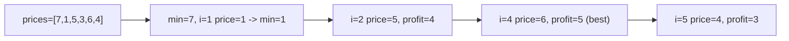

# 15. Best Time to Buy and Sell Stock

## Problem

You are given an array of prices where `prices[i]` is the price of a stock on day `i`. You must buy the stock on one day and sell it on a later day to maximize your profit. If you cannot make any profit, return 0.

## Example 1

### Input

```text
prices = [7,1,5,3,6,4]
```

### Expected Output

```text
5
```

### Explanation

Buy on day 2 (price = 1) and sell on day 5 (price = 6), profit = 6 - 1 = 5.

## Example 2

### Input

```text
prices = [7,6,4,3,1]
```

### Expected Output

```text
0
```

### Explanation

Prices keep falling, so no profit is possible. Return 0.

## How to Solve

### Key Idea

Keep track of the lowest price seen so far as you walk through the array, and check how much profit selling today would give.

### Approach

1. Keep a variable `min_price` set to the first price (or infinity).
2. Loop through each price. Update `min_price` if the current price is lower.
3. Calculate profit as `current price - min_price`, and keep the maximum profit seen.

### Why It Works

By always remembering the cheapest price so far, you only ever consider valid buy-then-sell pairs (buy before sell), and checking every day guarantees you find the best possible sell day for the best buy day.

## Visual Explanation



## Optimal Solution

```python
class Solution:
    def maxProfit(self, prices: list[int]) -> int:
        min_price = float("inf")
        max_profit = 0

        for price in prices:
            if price < min_price:
                min_price = price
            else:
                max_profit = max(max_profit, price - min_price)

        return max_profit
```

## Complexity

- **Time:** O(n)
- **Space:** O(1)

## Real-World Uses

- Tracking the best entry/exit point in real trading and backtesting algorithms.
- Finding the largest single-pass drawdown or gain in monitoring dashboards (e.g., server load, stock tickers).
- Detecting the best buy-low/sell-high window in price-tracking browser extensions and shopping tools.

## Key Takeaway

This is a simple sliding window pattern where you track a running minimum instead of using two nested loops. Many array problems can be solved in one pass by remembering just one piece of state.
