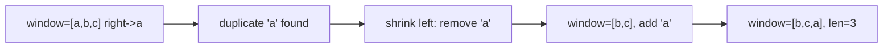

# 16. Longest Substring Without Repeating Characters

## Problem

Given a string `s`, find the length of the longest substring that does not contain any repeated characters. A substring is a contiguous run of characters within the string.

## Example 1

### Input

```text
s = "abcabcbb"
```

### Expected Output

```text
3
```

### Explanation

The longest substring without repeating characters is "abc", which has length 3.

## Example 2

### Input

```text
s = "pwwkew"
```

### Expected Output

```text
3
```

### Explanation

The longest substring without repeating characters is "wke", which has length 3.

## How to Solve

### Key Idea

Use a sliding window of characters with no duplicates. Grow the window by moving the right edge, and shrink it from the left whenever you see a repeated character.

### Approach

1. Use two pointers, `left` and `right`, both starting at 0, and a set to track characters currently in the window.
2. Move `right` forward one step at a time. If `s[right]` is already in the set, remove characters from the left of the window (and from the set) until it's not.
3. Add `s[right]` to the set and update the best length as `right - left + 1`.

### Why It Works

The window always represents a valid substring with no duplicates. Every character is added once and removed at most once, so the window slides across the string efficiently while always tracking the best size.

## Visual Explanation



## Optimal Solution

```python
class Solution:
    def lengthOfLongestSubstring(self, s: str) -> int:
        seen = set()
        left = 0
        best = 0

        for right in range(len(s)):
            while s[right] in seen:
                seen.remove(s[left])
                left += 1
            seen.add(s[right])
            best = max(best, right - left + 1)

        return best
```

## Complexity

- **Time:** O(n)
- **Space:** O(min(n, alphabet size))

## Real-World Uses

- Enforcing unique-session or unique-token windows in rate-limiting and deduplication systems.
- Finding the longest run of unique events in log analysis or fraud-detection pipelines.
- Auto-suggesting the longest unique-character segment in text editors or username validators.

## Key Takeaway

This is the classic "variable-size sliding window" pattern: expand the right side to explore, shrink the left side to fix a violated condition. It shows up whenever you need the longest/shortest substring meeting some rule.
