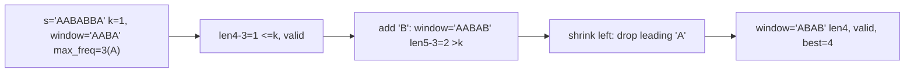

# 17. Longest Repeating Character Replacement

## Problem

You are given a string `s` consisting of uppercase letters and an integer `k`. You can change up to `k` characters in the string to any other uppercase letter. Find the length of the longest substring you can make consist of a single repeating character after doing these replacements.

## Example 1

### Input

```text
s = "XYYX", k = 2
```

### Expected Output

```text
4
```

### Explanation

Replace both "X" characters with "Y" (or vice versa) to get "YYYY" or "XXXX", giving a substring of length 4 using at most 2 replacements.

## Example 2

### Input

```text
s = "AABABBA", k = 1
```

### Expected Output

```text
4
```

### Explanation

Replace one "B" in "AABA" to get "AAAA", a substring of length 4, using only 1 replacement.

## How to Solve

### Key Idea

Use a sliding window and track the count of the most frequent letter inside it. A window is valid if (window length - count of most frequent letter) is at most `k`, meaning you have enough replacements to turn everything else into that letter.

### Approach

1. Use two pointers `left` and `right` to define the window, and a frequency count (dict or array) of letters inside it.
2. Expand `right` one step at a time, updating the count and tracking `max_freq`, the highest count of any single letter seen in the current window.
3. If `(right - left + 1) - max_freq > k`, the window needs too many replacements, so shrink from the left (decrement count, move `left` forward). Track the max window length throughout.

### Why It Works

The window only needs to shrink when the number of "different" characters (that must be replaced) exceeds `k`. Since we only ever care about the best possible window, `max_freq` never actually needs to decrease when we shrink — it just means we won't find a better answer with a smaller window, so tracking it loosely still gives the correct max length.

## Visual Explanation



## Optimal Solution

```python
class Solution:
    def characterReplacement(self, s: str, k: int) -> int:
        count = {}
        left = 0
        max_freq = 0
        best = 0

        for right in range(len(s)):
            count[s[right]] = count.get(s[right], 0) + 1
            max_freq = max(max_freq, count[s[right]])

            window_len = right - left + 1
            if window_len - max_freq > k:
                count[s[left]] -= 1
                left += 1

            best = max(best, right - left + 1)

        return best
```

## Complexity

- **Time:** O(n)
- **Space:** O(1) (at most 26 letters)

## Real-World Uses

- Error-tolerant pattern matching, like DNA sequence analysis allowing a few mismatches.
- Data compression heuristics that find the longest run compressible with a limited number of substitutions.
- Spell-check/autocorrect features that tolerate a bounded number of character edits in a run.

## Key Takeaway

This is a sliding window with an extra "budget" condition (`k` replacements). Whenever a problem lets you make a limited number of changes, track how much budget the current window uses and shrink when it's exceeded.
