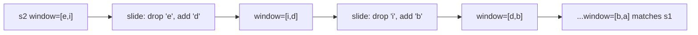

# 18. Permutation in String

## Problem

Given two strings `s1` and `s2`, determine whether `s2` contains a substring that is a permutation (any reordering) of `s1`. Return true if such a substring exists, otherwise return false.

## Example 1

### Input

```text
s1 = "ab", s2 = "eidbaooo"
```

### Expected Output

```text
true
```

### Explanation

"eidbaooo" contains "ba", which is a permutation of "ab".

## Example 2

### Input

```text
s1 = "ab", s2 = "eidboaoo"
```

### Expected Output

```text
false
```

### Explanation

No substring of "eidboaoo" of length 2 is a rearrangement of "ab".

## How to Solve

### Key Idea

A permutation of `s1` has exactly the same letter counts as `s1`, just in a different order. Slide a fixed-size window (the length of `s1`) across `s2` and check if the letter counts inside the window ever match `s1`'s letter counts exactly.

### Approach

1. If `s1` is longer than `s2`, return false immediately. Build a frequency count of `s1`, and a frequency count of the first window of `s2` (same length as `s1`).
2. Slide the window one character at a time across `s2`: add the new character entering the window, remove the character leaving the window, updating counts.
3. After each slide, compare the window's frequency count to `s1`'s frequency count. If they match at any point, return true. If the loop finishes with no match, return false.

### Why It Works

Since a permutation must have identical character counts, comparing frequency counts of a fixed-size window is equivalent to checking "is this substring a rearrangement of s1?" Sliding the window and updating counts incrementally avoids recomputing counts from scratch each time.

## Visual Explanation



## Optimal Solution

```python
class Solution:
    def checkInclusion(self, s1: str, s2: str) -> bool:
        n, m = len(s1), len(s2)
        if n > m:
            return False

        s1_count = [0] * 26
        window_count = [0] * 26

        for i in range(n):
            s1_count[ord(s1[i]) - ord('a')] += 1
            window_count[ord(s2[i]) - ord('a')] += 1

        if s1_count == window_count:
            return True

        for i in range(n, m):
            window_count[ord(s2[i]) - ord('a')] += 1
            window_count[ord(s2[i - n]) - ord('a')] -= 1

            if s1_count == window_count:
                return True

        return False
```

## Complexity

- **Time:** O(n + m) where n = len(s1), m = len(s2)
- **Space:** O(1) (fixed-size 26-letter arrays)

## Real-World Uses

- Detecting anagram-based plagiarism or obfuscated keyword matches in text scanning tools.
- Scanning network byte streams for fixed-length patterns regardless of byte order (e.g., signature detection).
- Matching shuffled tile/letter combinations in word-game solvers.

## Key Takeaway

This is a fixed-size sliding window problem: instead of growing and shrinking the window, it just slides forward by one step each time, keeping a running frequency count. Comparing counts (not order) is the trick for permutation-related string problems.
