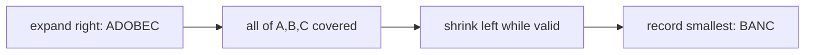

# 19. Minimum Window Substring

## Problem

Given two strings `s` and `t`, find the smallest substring of `s` that contains every character in `t`, including duplicates (if `t` has two "a"s, the substring must contain at least two "a"s too). If no such substring exists, return an empty string.

## Example 1

### Input

```text
s = "ADOBECODEBANC", t = "ABC"
```

### Expected Output

```text
"BANC"
```

### Explanation

"BANC" is the smallest substring of `s` that contains 'A', 'B', and 'C'.

## Example 2

### Input

```text
s = "a", t = "aa"
```

### Expected Output

```text
""
```

### Explanation

`s` only has one 'a', but `t` requires two, so no valid window exists.

## How to Solve

### Key Idea

Use a sliding window that grows until it contains all required characters, then shrink it from the left as much as possible while it's still valid, recording the smallest valid window found.

### Approach

1. Count the characters needed from `t`. Track how many distinct required characters are currently satisfied in the window.
2. Expand the window by moving `right` forward, updating counts. Whenever all required characters are satisfied, try shrinking from the left to make the window smaller, updating the best answer each time it's still valid.
3. Continue until `right` reaches the end of `s`. Return the smallest valid window found, or an empty string if none was found.

### Why It Works

Growing the window guarantees we eventually cover all needed characters, and shrinking greedily from the left removes waste without breaking the "contains all of t" condition, so we always find the smallest valid window that ends at each `right` position — and therefore the smallest overall.

## Visual Explanation



## Optimal Solution

```python
from collections import Counter

class Solution:
    def minWindow(self, s: str, t: str) -> str:
        if not s or not t:
            return ""

        need = Counter(t)
        missing = len(t)  # total characters still needed (with duplicates)

        left = 0
        best_len = float("inf")
        best_left = 0

        for right, char in enumerate(s):
            if need[char] > 0:
                missing -= 1
            need[char] -= 1

            while missing == 0:
                if right - left + 1 < best_len:
                    best_len = right - left + 1
                    best_left = left

                need[s[left]] += 1
                if need[s[left]] > 0:
                    missing += 1
                left += 1

        return "" if best_len == float("inf") else s[best_left:best_left + best_len]
```

## Complexity

- **Time:** O(n + m) where n = len(s), m = len(t)
- **Space:** O(m) for the character count map

## Real-World Uses

- Search engines and IDEs finding the smallest text span containing all query terms.
- Log analysis tools locating the shortest time window in which a required set of events all occurred.
- Bioinformatics tools finding the shortest DNA segment containing a required set of markers.

## Key Takeaway

This is the "expand then shrink" sliding window pattern for finding minimum valid windows. Track how many required conditions are still unmet with a single counter (`missing`) instead of comparing whole frequency maps every step, which keeps it efficient.
