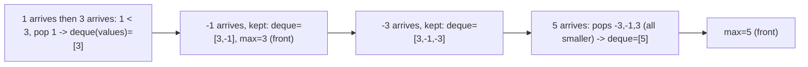

# 20. Sliding Window Maximum

## Problem

Given an array of integers `nums` and an integer `k`, there is a window of size `k` that slides from the very left of the array to the very right, one position at a time. Return an array of the maximum value in the window at each position.

## Example 1

### Input

```text
nums = [1,3,-1,-3,5,3,6,7], k = 3
```

### Expected Output

```text
[3,3,5,5,6,7]
```

### Explanation

Window [1,3,-1] -> 3, [3,-1,-3] -> 3, [-1,-3,5] -> 5, [-3,5,3] -> 5, [5,3,6] -> 6, [3,6,7] -> 7.

## Example 2

### Input

```text
nums = [1,-1], k = 1
```

### Expected Output

```text
[1,-1]
```

### Explanation

With a window size of 1, the maximum of each window is just the element itself.

## How to Solve

### Key Idea

Keep a deque (double-ended queue) of useful candidate indices for the maximum, in decreasing order of their values. The front of the deque is always the index of the current window's maximum.

### Approach

1. Use a deque to store indices of `nums`. Process each index `i` from left to right.
2. Before adding index `i`, remove indices from the back of the deque whose values are less than `nums[i]` (they can never be the max again). Then add `i` to the back.
3. Remove the index at the front if it has fallen out of the window (`front index <= i - k`). Once `i >= k - 1`, record `nums[front of deque]` as the max for that window.

### Why It Works

Any element smaller than a later element in the window can never become the maximum while that later, bigger element is still inside the window, so it's safe to discard it. This keeps the deque small and always sorted in decreasing order, so the front is always the max of the current window.

## Visual Explanation



## Optimal Solution

```python
from collections import deque

class Solution:
    def maxSlidingWindow(self, nums: list[int], k: int) -> list[int]:
        dq = deque()  # stores indices, values in decreasing order
        result = []

        for i, num in enumerate(nums):
            while dq and nums[dq[-1]] < num:
                dq.pop()
            dq.append(i)

            if dq[0] <= i - k:
                dq.popleft()

            if i >= k - 1:
                result.append(nums[dq[0]])

        return result
```

## Complexity

- **Time:** O(n) — each index is added and removed from the deque at most once
- **Space:** O(k) for the deque

## Real-World Uses

- Computing rolling maximum/minimum metrics in real-time monitoring dashboards (CPU, latency, network throughput).
- Order book / trading systems tracking the highest bid within a moving time window.
- Video/audio signal processing for peak detection over a moving frame window.

## Key Takeaway

This is the "monotonic deque" sliding window pattern: useful for finding a running maximum (or minimum) over a moving window in linear time, instead of recomputing it with a nested loop.
