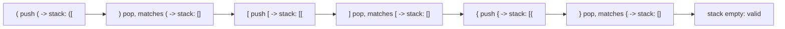

# 21. Valid Parentheses

## Problem

You are given a string containing only the characters `(`, `)`, `{`, `}`, `[`, and `]`. Determine if the string is valid, meaning every opening bracket is closed by the same type of bracket, and brackets are closed in the correct order.

## Example 1

### Input

```text
s = "()[]{}"
```

### Expected Output

```text
true
```

### Explanation

Each pair of brackets opens and closes in the right order.

## Example 2

### Input

```text
s = "(]"
```

### Expected Output

```text
false
```

### Explanation

`(` is closed by `]`, which is the wrong type of bracket.

## How to Solve

### Key Idea

Use a stack to remember which opening brackets are still waiting to be closed. When you see a closing bracket, it must match the most recent unclosed opening bracket.

### Approach

1. Create an empty stack and a map of closing bracket to its matching opening bracket.
2. Go through each character in the string. If it is an opening bracket, push it onto the stack.
3. If it is a closing bracket, check the top of the stack: if it's empty or doesn't match, return false; otherwise pop the stack.
4. At the end, the string is valid only if the stack is empty.

### Why It Works

A stack naturally tracks "most recent unclosed item first," which matches how brackets must be closed in reverse order of opening (last opened, first closed).

## Visual Explanation



## Optimal Solution

```python
class Solution:
    def isValid(self, s: str) -> bool:
        stack = []
        pairs = {')': '(', ']': '[', '}': '{'}

        for ch in s:
            if ch in pairs:
                if not stack or stack[-1] != pairs[ch]:
                    return False
                stack.pop()
            else:
                stack.append(ch)

        return not stack
```

## Complexity

- **Time:** O(n)
- **Space:** O(n)

## Real-World Uses

- Validating balanced brackets/parentheses in compilers and code editors.
- Checking well-formed tags in HTML/XML parsers.
- Verifying matching delimiters in JSON linters and syntax highlighters.

## Key Takeaway

Whenever you need to match "most recent unclosed" items, like nested brackets or nested structures, a stack is the right tool.
