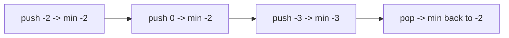

# 22. Min Stack

## Problem

Design a stack that supports `push`, `pop`, `top`, and `getMin` operations, where `getMin` returns the minimum element in the stack, all in O(1) time.

## Example 1

### Input

```text
operations = ["MinStack", "push(-2)", "push(0)", "push(-3)", "getMin()", "pop()", "top()", "getMin()"]
```

### Expected Output

```text
[null, null, null, null, -3, null, 0, -2]
```

### Explanation

After pushing -2, 0, -3, the minimum is -3. After popping -3, the top becomes 0, and the new minimum is -2.

## Example 2

### Input

```text
operations = ["MinStack", "push(5)", "push(2)", "getMin()", "push(1)", "getMin()", "pop()", "getMin()"]
```

### Expected Output

```text
[null, null, null, 2, null, 1, null, 2]
```

### Explanation

The minimum updates as elements are pushed and popped, always reflecting the smallest value currently in the stack.

## How to Solve

### Key Idea

Keep a second stack that tracks the minimum value at each point in time, alongside the main stack.

### Approach

1. Maintain two stacks: one for actual values, one for the minimum seen so far at each level.
2. When pushing a value, also push the smaller of that value and the current minimum onto the min-stack.
3. When popping, pop from both stacks together so they stay in sync.
4. `getMin()` simply returns the top of the min-stack in O(1) time.

### Why It Works

Since both stacks grow and shrink together, the top of the min-stack always represents the minimum of exactly the elements currently in the main stack.

## Visual Explanation



## Optimal Solution

```python
class MinStack:
    def __init__(self):
        self.stack = []
        self.min_stack = []

    def push(self, val: int) -> None:
        self.stack.append(val)
        if self.min_stack:
            self.min_stack.append(min(val, self.min_stack[-1]))
        else:
            self.min_stack.append(val)

    def pop(self) -> None:
        self.stack.pop()
        self.min_stack.pop()

    def top(self) -> int:
        return self.stack[-1]

    def getMin(self) -> int:
        return self.min_stack[-1]
```

## Complexity

- **Time:** O(1) for every operation
- **Space:** O(n)

## Real-World Uses

- Undo/redo history tracking in editors, where you need the latest state instantly.
- Browser back-button navigation stacks.
- Tracking running min/max in monitoring dashboards without recomputation.

## Key Takeaway

When you need extra information (like the running minimum) alongside a stack's normal behavior, track it with a parallel stack instead of recomputing it each time.
