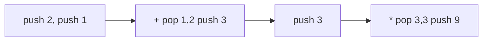

# 23. Evaluate Reverse Polish Notation

## Problem

You are given a list of tokens representing an arithmetic expression in Reverse Polish Notation (postfix notation), where operators come after their operands. Evaluate the expression and return the result as an integer. Valid operators are `+`, `-`, `*`, and `/` (integer division that truncates toward zero).

## Example 1

### Input

```text
tokens = ["2", "1", "+", "3", "*"]
```

### Expected Output

```text
9
```

### Explanation

`(2 + 1) * 3 = 9`.

## Example 2

### Input

```text
tokens = ["4", "13", "5", "/", "+"]
```

### Expected Output

```text
6
```

### Explanation

`13 / 5 = 2` (truncated), then `4 + 2 = 6`.

## How to Solve

### Key Idea

Use a stack to hold numbers. Whenever you see an operator, pop the last two numbers, apply the operator, and push the result back.

### Approach

1. Create an empty stack.
2. Go through each token: if it's a number, push it onto the stack.
3. If it's an operator, pop the top two numbers (second popped is the left operand, first popped is the right operand), apply the operator, and push the result back.
4. After processing all tokens, the single remaining value on the stack is the answer.

### Why It Works

Postfix notation is designed so operands always appear before their operator, so a stack naturally holds the operands in the exact order needed for each operation to resolve correctly.

## Visual Explanation



## Optimal Solution

```python
class Solution:
    def evalRPN(self, tokens: list[str]) -> int:
        stack = []
        operators = {'+', '-', '*', '/'}

        for token in tokens:
            if token in operators:
                b = stack.pop()
                a = stack.pop()
                if token == '+':
                    stack.append(a + b)
                elif token == '-':
                    stack.append(a - b)
                elif token == '*':
                    stack.append(a * b)
                else:
                    stack.append(int(a / b))  # truncate toward zero
            else:
                stack.append(int(token))

        return stack[-1]
```

## Complexity

- **Time:** O(n)
- **Space:** O(n)

## Real-World Uses

- Calculator apps and expression evaluators that parse postfix or infix expressions.
- Interpreters and compilers evaluating arithmetic in stack-based virtual machines.
- Spreadsheet formula engines evaluating nested operations.

## Key Takeaway

Postfix expressions are a classic sign to use a stack: operands accumulate until an operator arrives, then the most recent ones combine first.
