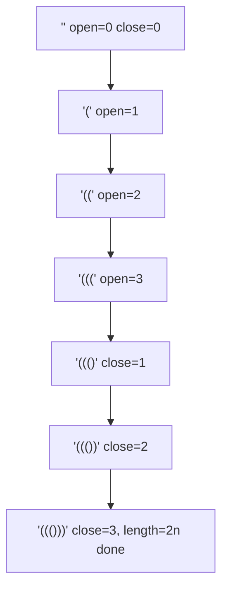

# 24. Generate Parentheses

## Problem

Given an integer `n` representing the number of pairs of parentheses, generate all combinations of well-formed (valid) parentheses using exactly `n` pairs.

## Example 1

### Input

```text
n = 3
```

### Expected Output

```text
["((()))", "(()())", "(())()", "()(())", "()()()"]
```

### Explanation

These are all the ways to arrange 3 pairs of parentheses so they are properly nested and closed.

## Example 2

### Input

```text
n = 1
```

### Expected Output

```text
["()"]
```

### Explanation

With only one pair, there's only one valid arrangement.

## How to Solve

### Key Idea

Build the string one character at a time, only adding an opening bracket if you still have some left, and only adding a closing bracket if it won't outnumber the opening brackets already placed.

### Approach

1. Use backtracking (recursion) with counters for how many `(` and `)` have been used so far.
2. At each step, if open count is less than n, you may add `(` and recurse.
3. At each step, if close count is less than open count, you may add `)` and recurse.
4. When the string length reaches `2*n`, it's a complete valid combination, so add it to the results.

### Why It Works

The rule "closing count must never exceed opening count" is exactly the condition for valid parentheses, so only exploring choices that satisfy it guarantees every generated string is valid, and trying both choices whenever allowed guarantees every valid string is found.

## Visual Explanation



## Optimal Solution

```python
class Solution:
    def generateParenthesis(self, n: int) -> list[str]:
        result = []

        def backtrack(current: list[str], open_count: int, close_count: int) -> None:
            if len(current) == 2 * n:
                result.append(''.join(current))
                return

            if open_count < n:
                current.append('(')
                backtrack(current, open_count + 1, close_count)
                current.pop()

            if close_count < open_count:
                current.append(')')
                backtrack(current, open_count, close_count + 1)
                current.pop()

        backtrack([], 0, 0)
        return result
```

## Complexity

- **Time:** O(4^n / sqrt(n)) (bounded by the nth Catalan number, the number of valid combinations)
- **Space:** O(4^n / sqrt(n)) for storing the results, plus O(n) recursion depth

## Real-World Uses

- Generating all valid syntax variants for autocomplete or code-formatting tools.
- Enumerating valid nested tag/bracket combinations for test-case generation.
- Building valid combinations in configuration or template generators.

## Key Takeaway

Backtracking with a simple validity rule (closing never exceeds opening) is a clean way to generate all valid parentheses combinations without ever building an invalid one.
