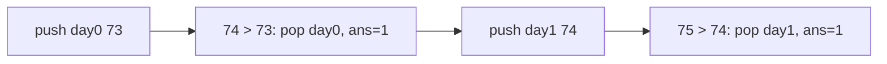

# 25. Daily Temperatures

## Problem

You are given a list of daily temperatures. For each day, find how many days you would have to wait until a warmer temperature. If there is no future day with a warmer temperature, put 0 for that day.

## Example 1

### Input

```text
temperatures = [73, 74, 75, 71, 69, 72, 76, 73]
```

### Expected Output

```text
[1, 1, 4, 2, 1, 1, 0, 0]
```

### Explanation

For day 0 (73), the next warmer day is day 1 (74), which is 1 day away. For day 6 (76), there is no warmer day after it, so the answer is 0.

## Example 2

### Input

```text
temperatures = [30, 40, 50, 60]
```

### Expected Output

```text
[1, 1, 1, 0]
```

### Explanation

Each temperature is immediately followed by a warmer one, except the last day, which has nothing after it.

## How to Solve

### Key Idea

Use a stack of day indices whose warmer day hasn't been found yet. As you scan forward, whenever the current temperature beats the temperature at the top of the stack, that day just found its answer.

### Approach

1. Create a result array of zeros with the same length as temperatures, and an empty stack.
2. For each day, while the stack is not empty and the current temperature is greater than the temperature at the index on top of the stack, pop that index and set its result as the difference between the current day and that index.
3. Push the current day's index onto the stack.
4. After processing all days, indices still left on the stack have no warmer future day, so they stay 0.

### Why It Works

The stack keeps indices in increasing order of their temperatures (a "waiting list"). The moment a bigger temperature appears, it resolves every smaller waiting temperature at once, so each index is pushed and popped only once, avoiding the need to rescan the array for every day.

## Visual Explanation



## Optimal Solution

```python
class Solution:
    def dailyTemperatures(self, temperatures: list[int]) -> list[int]:
        result = [0] * len(temperatures)
        stack = []  # stores indices

        for i, temp in enumerate(temperatures):
            while stack and temperatures[stack[-1]] < temp:
                prev_index = stack.pop()
                result[prev_index] = i - prev_index
            stack.append(i)

        return result
```

## Complexity

- **Time:** O(n)
- **Space:** O(n)

## Real-World Uses

- Finding the next higher stock price in financial time-series analysis.
- Detecting the next sensor reading that exceeds a threshold in monitoring systems.
- Computing "next warmer/colder day" style analytics in weather data pipelines.

## Key Takeaway

A "monotonic stack" (here, a stack of unresolved indices with decreasing temperatures) is the go-to pattern for "next greater element" style problems.
