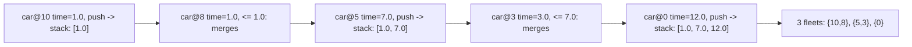

# 26. Car Fleet

## Problem

There are cars heading to the same destination along a one-lane road. Each car has a starting position and a speed. A car fleet forms when a faster car catches up to a slower car ahead of it; they then travel together as one fleet at the slower car's speed. Given each car's position and speed, and the target destination, find how many fleets will arrive.

## Example 1

### Input

```text
target = 12, position = [10, 8, 0, 5, 3], speed = [2, 4, 1, 1, 3]
```

### Expected Output

```text
3
```

### Explanation

The car at position 10 (speed 2) and the car at 8 (speed 4) merge into one fleet because the faster car catches up before reaching the target. The car at 0 (speed 1) travels alone. The cars at 5 and 3 merge into another fleet. This results in 3 fleets total.

## Example 2

### Input

```text
target = 10, position = [3], speed = [3]
```

### Expected Output

```text
1
```

### Explanation

With only one car, there is exactly one fleet.

## How to Solve

### Key Idea

Process cars from the one closest to the destination to the one farthest. Compute how long each car takes to reach the destination alone; if a car behind would take less time than the car ahead of it (already grouped), it catches up and joins that fleet instead of forming a new one.

### Approach

1. Pair each car's position with its speed, and sort the cars by position in descending order (closest to target first).
2. For each car, calculate the time it would take to reach the target: `(target - position) / speed`.
3. Use a stack to track the time of the fleet currently at the front. If the current car's time is less than or equal to the time on top of the stack, it merges into that fleet (don't push a new time). Otherwise, it forms a new fleet, so push its time.
4. The number of fleets is the final size of the stack.

### Why It Works

Sorting by position from closest to farthest lets us always compare a trailing car against the fleet directly ahead of it. If the trailing car would reach the destination sooner or at the same time as the car ahead, it must catch up and slow down to match, joining that fleet; otherwise it's slower and forms its own new fleet.

## Visual Explanation



## Optimal Solution

```python
class Solution:
    def carFleet(self, target: int, position: list[int], speed: list[int]) -> int:
        cars = sorted(zip(position, speed), reverse=True)
        stack = []

        for pos, spd in cars:
            time = (target - pos) / spd
            if not stack or time > stack[-1]:
                stack.append(time)
            # else: this car catches up to the fleet ahead, no new fleet

        return len(stack)
```

## Complexity

- **Time:** O(n log n) for sorting
- **Space:** O(n)

## Real-World Uses

- Simulating traffic flow and vehicle platooning on highways.
- Modeling queueing/merging behavior in network packet processing.
- Analyzing convoy or fleet formation in logistics and delivery routing.

## Key Takeaway

When elements can "merge" based on catching up to something ahead of them, sort by position and use a stack to track the current groups, only pushing when a new, slower group starts.
