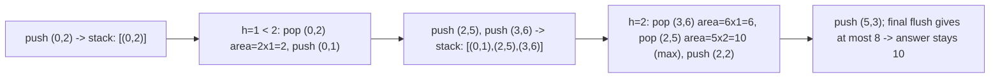

# 27. Largest Rectangle in Histogram

## Problem

You are given a list of bar heights forming a histogram, where each bar has width 1. Find the area of the largest rectangle that can be formed using contiguous bars.

## Example 1

### Input

```text
heights = [2, 1, 5, 6, 2, 3]
```

### Expected Output

```text
10
```

### Explanation

The largest rectangle is formed by the bars with heights 5 and 6 (width 2, height 5), giving an area of 10.

## Example 2

### Input

```text
heights = [2, 4]
```

### Expected Output

```text
4
```

### Explanation

Using just the bar of height 4 (width 1) gives area 4, and using both bars at height 2 (width 2) also gives area 4. Using either single bar or their overlap, the maximum is 4.

## How to Solve

### Key Idea

For every bar, imagine it as the shortest bar in some rectangle. Use a stack to efficiently find, for each bar, how far left and right the rectangle can stretch before hitting a shorter bar.

### Approach

1. Keep a stack of indices with increasing bar heights, plus each bar's "starting" position for its potential rectangle.
2. For each bar, while the stack's top has a height greater than the current bar's height, pop it and compute the rectangle area using that popped height and the width stretching from its start index to the current index.
3. Push the current bar's index (using the start index of the last popped bar if any bars were merged, since they're all at least as tall as the current bar).
4. After scanning all bars, pop any remaining bars in the stack and compute their rectangle areas using the end of the array as the right boundary.

### Why It Works

The stack always holds bars in increasing height order along with the leftmost index they could extend to. When a shorter bar appears, every taller bar in the stack now knows its right boundary (the current index) and its left boundary (already tracked), so its maximum rectangle area can be finalized exactly once.

## Visual Explanation



## Optimal Solution

```python
class Solution:
    def largestRectangleArea(self, heights: list[int]) -> int:
        stack = []  # pairs of (start_index, height)
        max_area = 0

        for i, h in enumerate(heights):
            start = i
            while stack and stack[-1][1] > h:
                idx, height = stack.pop()
                max_area = max(max_area, height * (i - idx))
                start = idx
            stack.append((start, h))

        for idx, height in stack:
            max_area = max(max_area, height * (len(heights) - idx))

        return max_area
```

## Complexity

- **Time:** O(n)
- **Space:** O(n)

## Real-World Uses

- Computing maximal rectangular regions in image processing (e.g., largest blank area detection).
- Optimizing layout/bin-packing algorithms in UI or warehouse space planning.
- Analyzing skyline/building silhouette problems in computational geometry.

## Key Takeaway

A monotonic increasing stack lets you find, for every bar, the widest rectangle it can anchor in a single linear pass, without checking every pair of bars.
