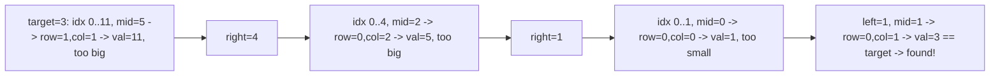

# 29. Search a 2D Matrix

## Problem

You are given an `m x n` matrix where each row is sorted left to right, and the first number of each row is greater than the last number of the previous row. This means if you read the matrix row by row, all the numbers are actually sorted in one long sequence. Given a target value, return true if it exists in the matrix, otherwise return false.

## Example 1

### Input

```text
matrix = [[1,3,5,7],[10,11,16,20],[23,30,34,60]], target = 3
```

### Expected Output

```text
true
```

### Explanation

3 is present in the first row of the matrix.

## Example 2

### Input

```text
matrix = [[1,3,5,7],[10,11,16,20],[23,30,34,60]], target = 13
```

### Expected Output

```text
false
```

### Explanation

13 does not appear anywhere in the matrix.

## How to Solve

### Key Idea

Since the whole matrix is sorted like one flattened array, you can treat it as a single sorted list and binary search over it using index math to map a 1D index to a row and column.

### Approach

1. Let `rows` and `cols` be the matrix dimensions. Set `left = 0` and `right = rows * cols - 1`.
2. While `left <= right`, compute `mid` and convert it to `row = mid // cols` and `col = mid % cols`.
3. Compare `matrix[row][col]` to the target and shrink the search range the same way as standard binary search, until found or the range is empty.

### Why It Works

Because rows are sorted and chained together (each row starts higher than the previous row ends), the entire matrix behaves like one sorted array, so binary search logic applies directly.

## Visual Explanation



## Optimal Solution

```python
class Solution:
    def searchMatrix(self, matrix: list[list[int]], target: int) -> bool:
        if not matrix or not matrix[0]:
            return False

        rows, cols = len(matrix), len(matrix[0])
        left, right = 0, rows * cols - 1

        while left <= right:
            mid = (left + right) // 2
            row, col = divmod(mid, cols)
            val = matrix[row][col]

            if val == target:
                return True
            elif val < target:
                left = mid + 1
            else:
                right = mid - 1

        return False
```

## Complexity

- **Time:** O(log(m * n))
- **Space:** O(1)

## Real-World Uses

- Searching a paginated, row-sorted spreadsheet or report export.
- Looking up a cell in a sorted 2D grid such as a heatmap or game board index.
- Querying sorted, chunked data (e.g., sharded sorted logs) treated as one virtual sequence.

## Key Takeaway

You can apply binary search to any structure that is sorted in a hidden or flattened way, not just plain 1D arrays, by mapping indices back to the original shape.
