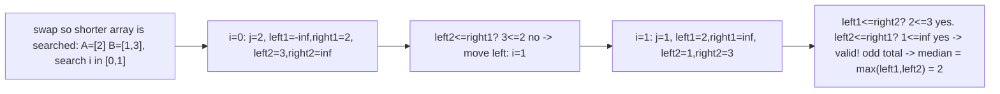

# 34. Median of Two Sorted Arrays

## Problem

You are given two sorted arrays of possibly different sizes. Find the median of the combined set of all elements from both arrays. Your solution must run in O(log(min(m, n))) time, where m and n are the array lengths.

## Example 1

### Input

```text
nums1 = [1,3], nums2 = [2]
```

### Expected Output

```text
2.0
```

### Explanation

The merged sorted array is [1,2,3], and its median is the middle value, 2.

## Example 2

### Input

```text
nums1 = [1,2], nums2 = [3,4]
```

### Expected Output

```text
2.5
```

### Explanation

The merged sorted array is [1,2,3,4]. With an even count, the median is the average of the two middle values, 2 and 3.

## How to Solve

### Key Idea

Instead of merging both arrays, binary search on how many elements to take from the smaller array's left partition. The correct partition is the one where every element on the left side of both partitions combined is less than or equal to every element on the right side.

### Approach

1. Make sure you binary search on the shorter array (swap if needed), so the search space stays O(log(min(m, n))).
2. For a candidate cut `i` in the shorter array, compute the matching cut `j` in the longer array so that the left partitions together hold exactly half (or half+1 for odd totals) of all elements.
3. Check the four border values around the cuts: if the left side is entirely <= the right side, you found the correct partition; otherwise move `i` left or right and repeat. Once found, compute the median from the border values, handling even and odd total lengths differently.

### Why It Works

Any valid partition point splits the combined array into a "left half" and "right half" of the correct sizes. Because both arrays are individually sorted, checking just the boundary elements (instead of merging everything) is enough to confirm the partition is valid, and binary searching over the smaller array's partition point converges on it in logarithmic time.

## Visual Explanation



## Optimal Solution

```python
class Solution:
    def findMedianSortedArrays(self, nums1: list[int], nums2: list[int]) -> float:
        # Ensure nums1 is the shorter array so we binary search the smaller size.
        if len(nums1) > len(nums2):
            nums1, nums2 = nums2, nums1

        m, n = len(nums1), len(nums2)
        total_left = (m + n + 1) // 2
        left, right = 0, m

        while left <= right:
            i = (left + right) // 2
            j = total_left - i

            left1 = nums1[i - 1] if i > 0 else float("-inf")
            right1 = nums1[i] if i < m else float("inf")
            left2 = nums2[j - 1] if j > 0 else float("-inf")
            right2 = nums2[j] if j < n else float("inf")

            if left1 <= right2 and left2 <= right1:
                if (m + n) % 2 == 0:
                    return (max(left1, left2) + min(right1, right2)) / 2
                else:
                    return max(left1, left2)
            elif left1 > right2:
                right = i - 1
            else:
                left = i + 1

        raise ValueError("Input arrays are not sorted")
```

## Complexity

- **Time:** O(log(min(m, n)))
- **Space:** O(1)

## Real-World Uses

- Merging sorted datasets or streams (e.g., combining two sorted result sets from sharded search indexes) to find percentile/median stats without a full merge.
- Computing running medians over merged sorted log or metrics streams from multiple sources.
- Efficiently combining two sorted leaderboards or ranked lists to find a combined rank statistic.

## Key Takeaway

Binary search isn't just for finding a value in one array; it can also search over a "partition point" to find a structural property (like a balanced split) across multiple sorted inputs.
