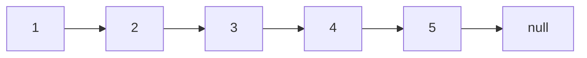
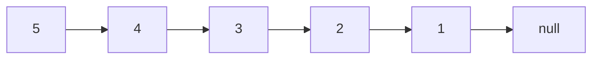

# 35. Reverse Linked List

## Problem

You are given the head of a singly linked list. Reverse the list and return the new head. In other words, every node's `next` pointer should now point to the previous node instead of the next one.

## Example 1

### Input

```text
head = [1,2,3,4,5]
```

### Expected Output

```text
[5,4,3,2,1]
```

### Explanation

The list is reversed end to end, so the old tail becomes the new head.

## Example 2

### Input

```text
head = [1,2]
```

### Expected Output

```text
[2,1]
```

### Explanation

With only two nodes, they simply swap order.

## How to Solve

### Key Idea

Walk through the list one node at a time and flip each node's `next` pointer to point backward instead of forward.

### Approach

1. Keep two pointers: `prev` (starts as `None`) and `curr` (starts at `head`).
2. While `curr` is not `None`, save `curr.next` in a temp variable, then set `curr.next = prev`.
3. Move `prev` to `curr` and `curr` to the saved temp, repeating until `curr` is `None`. Return `prev` as the new head.

### Why It Works

Each node only needs its `next` pointer changed once, and by remembering the next node before overwriting the pointer, we never lose our place in the list.

## Visual Explanation

Before reversal (`head = [1,2,3,4,5]`), `next` pointers go forward:



After reversal, each `next` pointer now points backward, so the old tail (5) is the new head:



## Optimal Solution

```python
class ListNode:
    def __init__(self, val=0, next=None):
        self.val = val
        self.next = next

class Solution:
    def reverseList(self, head: ListNode) -> ListNode:
        prev, curr = None, head
        while curr:
            next_node = curr.next
            curr.next = prev
            prev = curr
            curr = next_node
        return prev
```

## Complexity

- **Time:** O(n) — we visit each node exactly once.
- **Space:** O(1) — only a few pointers are used, no extra data structures.

## Real-World Uses

- Undo/redo history stacks that need to be replayed backward.
- Reversing a browser's navigation history or a playlist queue.
- Implementing "back" traversal in singly linked data structures without extra storage.

## Key Takeaway

Reversing a linked list in place with three pointers (`prev`, `curr`, `next`) is a foundational pattern that shows up in many other linked list problems.
