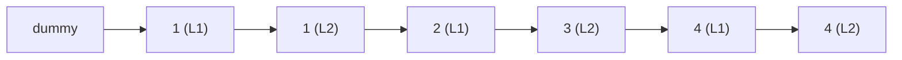

# 36. Merge Two Sorted Lists

## Problem

You are given the heads of two sorted linked lists. Merge them into one sorted linked list by splicing their nodes together, and return the head of the merged list.

## Example 1

### Input

```text
list1 = [1,2,4], list2 = [1,3,4]
```

### Expected Output

```text
[1,1,2,3,4,4]
```

### Explanation

Values from both lists are combined in sorted order.

## Example 2

### Input

```text
list1 = [], list2 = [0]
```

### Expected Output

```text
[0]
```

### Explanation

When one list is empty, the result is just the other list.

## How to Solve

### Key Idea

Use a dummy placeholder node to build the merged list, always attaching whichever of the two current nodes has the smaller value.

### Approach

1. Create a dummy node and a `tail` pointer starting at the dummy.
2. While both lists have nodes left, compare the front values and attach the smaller one to `tail`, then move that list's pointer forward and move `tail` forward.
3. When one list runs out, attach the remainder of the other list directly, then return `dummy.next`.

### Why It Works

Since both input lists are already sorted, comparing their current fronts at each step and always picking the smaller guarantees the output stays sorted.

## Visual Explanation



## Optimal Solution

```python
class ListNode:
    def __init__(self, val=0, next=None):
        self.val = val
        self.next = next

class Solution:
    def mergeTwoLists(self, list1: ListNode, list2: ListNode) -> ListNode:
        dummy = ListNode()
        tail = dummy

        while list1 and list2:
            if list1.val <= list2.val:
                tail.next = list1
                list1 = list1.next
            else:
                tail.next = list2
                list2 = list2.next
            tail = tail.next

        tail.next = list1 if list1 else list2
        return dummy.next
```

## Complexity

- **Time:** O(n + m) — where n and m are the lengths of the two lists; each node is visited once.
- **Space:** O(1) — nodes are re-linked in place, no new nodes are created.

## Real-World Uses

- Merging sorted result sets from multiple database shards or search indexes.
- Combining sorted event streams from different sources into one timeline.
- Merge step of external/merge sort implementations for large datasets.

## Key Takeaway

The dummy-node technique is a simple trick that avoids special-casing the head of the result list, and is reusable whenever you build a new linked list from scratch.
