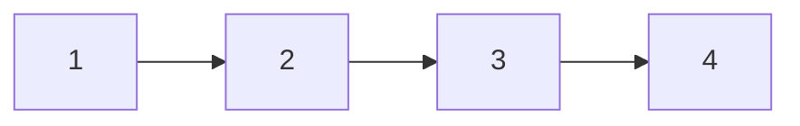

# 37. Reorder List

## Problem

You are given the head of a singly linked list representing the sequence `L0, L1, ..., Ln-1, Ln`. Reorder it in place to become `L0, Ln, L1, Ln-1, L2, Ln-2, ...`. You must not just change the node values; you must actually rearrange the nodes themselves.

## Example 1

### Input

```text
head = [1,2,3,4]
```

### Expected Output

```text
[1,4,2,3]
```

### Explanation

The first node stays first, then the last node, then the second, then the second-to-last.

## Example 2

### Input

```text
head = [1,2,3,4,5]
```

### Expected Output

```text
[1,5,2,4,3]
```

### Explanation

Nodes alternate from the front and back of the original list until they meet in the middle.

## How to Solve

### Key Idea

Split the list into two halves, reverse the second half, then merge the two halves by alternating nodes from each.

### Approach

1. Use slow/fast pointers to find the middle of the list, splitting it into a first half and a second half.
2. Reverse the second half in place using the standard three-pointer reversal.
3. Merge the two halves by alternating: one node from the first half, then one from the reversed second half, repeating until all nodes are placed.

### Why It Works

Reordering the list this way is equivalent to zig-zagging between the front half and the reversed back half, so splitting, reversing the tail, and interleaving directly produces the required pattern.

## Visual Explanation

Original list, split at the middle:



Reordered result after reversing the second half and interleaving:


## Optimal Solution

```python
class ListNode:
    def __init__(self, val=0, next=None):
        self.val = val
        self.next = next

class Solution:
    def reorderList(self, head: ListNode) -> None:
        if not head or not head.next:
            return

        # Step 1: find the middle
        slow, fast = head, head
        while fast.next and fast.next.next:
            slow = slow.next
            fast = fast.next.next

        # Step 2: reverse the second half
        second = slow.next
        slow.next = None
        prev = None
        while second:
            nxt = second.next
            second.next = prev
            prev = second
            second = nxt
        second = prev

        # Step 3: merge the two halves
        first = head
        while second:
            tmp1, tmp2 = first.next, second.next
            first.next = second
            second.next = tmp1
            first = tmp1
            second = tmp2
```

## Complexity

- **Time:** O(n) — finding the middle, reversing, and merging are each a single pass.
- **Space:** O(1) — everything is done by rearranging existing node pointers.

## Real-World Uses

- Rearranging playback order in a media queue for a "shuffle-like" front/back pattern.
- Restructuring data for zig-zag serialization formats.
- Building palindrome-check or interleaving utilities on sequential data.

## Key Takeaway

Combining the "find the middle with slow/fast pointers" and "reverse a linked list" patterns lets you solve trickier rearrangement problems by breaking them into smaller, familiar steps.
