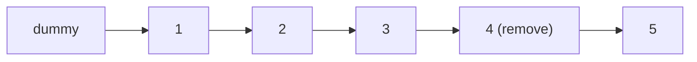

# 38. Remove Nth Node From End of List

## Problem

You are given the head of a linked list and an integer `n`. Remove the `n`th node from the end of the list and return the head of the modified list. You should aim to do this in one pass.

## Example 1

### Input

```text
head = [1,2,3,4,5], n = 2
```

### Expected Output

```text
[1,2,3,5]
```

### Explanation

The 2nd node from the end is the node with value 4, so it gets removed.

## Example 2

### Input

```text
head = [1], n = 1
```

### Expected Output

```text
[]
```

### Explanation

The only node is the 1st from the end, so removing it leaves an empty list.

## How to Solve

### Key Idea

Use two pointers with a fixed gap of `n` nodes between them; when the front pointer reaches the end, the back pointer is right before the node to remove.

### Approach

1. Create a dummy node pointing to `head` and set both `fast` and `slow` pointers to the dummy.
2. Move `fast` forward `n + 1` times so there is a gap of `n` nodes between `fast` and `slow`.
3. Move `fast` and `slow` forward together until `fast` becomes `None`; then `slow.next` is the node to remove, so set `slow.next = slow.next.next` and return `dummy.next`.

### Why It Works

Keeping a constant gap of `n` nodes means that when the fast pointer finishes the list, the slow pointer is exactly one node before the target, letting us unlink it directly without needing to know the list's length in advance.

## Visual Explanation



`fast` and `slow` keep an `n`-node gap; when `fast` hits the end, `slow` sits right before the node to remove.

## Optimal Solution

```python
class ListNode:
    def __init__(self, val=0, next=None):
        self.val = val
        self.next = next

class Solution:
    def removeNthFromEnd(self, head: ListNode, n: int) -> ListNode:
        dummy = ListNode(0, head)
        slow = fast = dummy

        for _ in range(n + 1):
            fast = fast.next

        while fast:
            slow = slow.next
            fast = fast.next

        slow.next = slow.next.next
        return dummy.next
```

## Complexity

- **Time:** O(L) — where L is the length of the list; a single pass with two pointers.
- **Space:** O(1) — only pointers are used, no extra storage.

## Real-World Uses

- Removing the Nth-most-recent entry from a log or history buffer without a length scan.
- Trimming trailing items from a streaming queue in one pass.
- Implementing "remove last k" operations on singly linked data pipelines.

## Key Takeaway

The "two pointers with a fixed gap" trick lets you find a position relative to the end of a linked list in one pass, without ever counting its total length.
