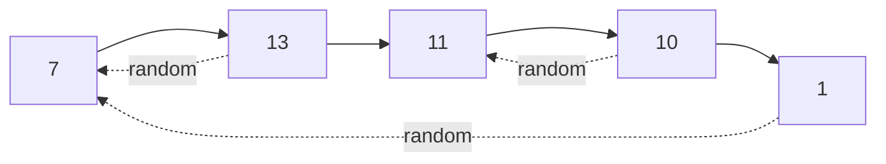

# 39. Copy List With Random Pointer

## Problem

You are given a linked list where each node has a `next` pointer and an additional `random` pointer that can point to any node in the list or to `None`. Create a deep copy of the list, where the copied nodes' `next` and `random` pointers point to nodes within the copied list, not the original.

## Example 1

### Input

```text
head = [[7,None],[13,0],[11,4],[10,2],[1,0]]
(each pair is [val, random_index], random_index is None if no random pointer)
```

### Expected Output

```text
[[7,None],[13,0],[11,4],[10,2],[1,0]]
```

### Explanation

The output list has the same values and the same random-pointer targets, but every node is a brand-new object, not shared with the input.

## Example 2

### Input

```text
head = [[1,1],[2,1]]
```

### Expected Output

```text
[[1,1],[2,1]]
```

### Explanation

Both copied nodes' random pointers point to node at index 1 (the second node), matching the original structure.

## How to Solve

### Key Idea

Use a hash map to link each original node to its brand-new copy, so that when wiring up `next` and `random` pointers you can always look up the correct copied node.

### Approach

1. First pass: walk the original list and create a copy of each node (val only), storing a mapping from `original_node -> copy_node` in a dictionary.
2. Second pass: walk the original list again, and for each node use the dictionary to set `copy.next = mapping[original.next]` and `copy.random = mapping[original.random]` (handling `None` safely).
3. Return `mapping[head]`, the copy corresponding to the original head.

### Why It Works

Because the dictionary remembers which copy corresponds to which original node, we can safely wire up pointers that jump forward or backward (like `random`) even though those target nodes might not have existed yet during a single pass.

## Visual Explanation



A hash map links each original node to its new copy so `next`/`random` on the copy can be rewired independently.

## Optimal Solution

```python
class Node:
    def __init__(self, x: int, next=None, random=None):
        self.val = x
        self.next = next
        self.random = random

class Solution:
    def copyRandomList(self, head: 'Node') -> 'Node':
        if not head:
            return None

        old_to_new = {}

        # First pass: create all copies with just values
        curr = head
        while curr:
            old_to_new[curr] = Node(curr.val)
            curr = curr.next

        # Second pass: wire up next and random pointers
        curr = head
        while curr:
            copy = old_to_new[curr]
            copy.next = old_to_new[curr.next] if curr.next else None
            copy.random = old_to_new[curr.random] if curr.random else None
            curr = curr.next

        return old_to_new[head]
```

## Complexity

- **Time:** O(n) — two linear passes over the list.
- **Space:** O(n) — the hash map stores one entry per node.

## Real-World Uses

- Deep-cloning object graphs with cross-references, such as UI component trees.
- Serializing/deserializing graph-like structures for caching or transfer.
- Copying a scene graph in games where nodes reference arbitrary other nodes.

## Key Takeaway

Whenever you need to deep-copy a structure with pointers that can point anywhere (not just forward), a hash map from old nodes to new nodes is the go-to technique.
