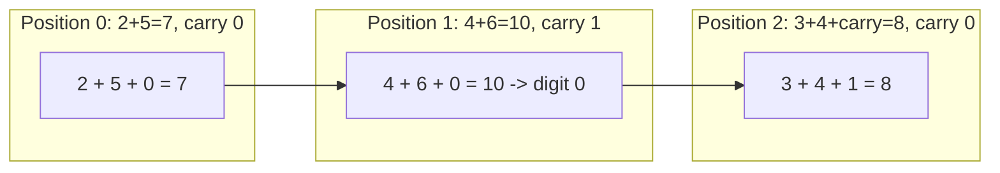

# 40. Add Two Numbers

## Problem

You are given two non-empty linked lists representing two non-negative integers. The digits are stored in reverse order, and each node holds a single digit. Add the two numbers and return the sum as a linked list, also in reverse order.

## Example 1

### Input

```text
l1 = [2,4,3], l2 = [5,6,4]
```

### Expected Output

```text
[7,0,8]
```

### Explanation

342 + 465 = 807, and 807 written in reverse digit order is [7,0,8].

## Example 2

### Input

```text
l1 = [9,9], l2 = [1]
```

### Expected Output

```text
[0,0,1]
```

### Explanation

99 + 1 = 100, and 100 in reverse digit order is [0,0,1].

## How to Solve

### Key Idea

Add the lists digit by digit just like elementary school addition, carrying over any overflow to the next position.

### Approach

1. Create a dummy node and a `curr` pointer to build the result list, and set `carry = 0`.
2. While there are still digits in either list or a leftover carry, sum the current digits (treating missing nodes as 0) plus the carry, then create a new node with `sum % 10` and update `carry = sum // 10`.
3. Advance both input pointers (if they exist) and the `curr` pointer, and finally return `dummy.next`.

### Why It Works

Since digits are already stored least-significant-first, processing them in list order mirrors how you'd add numbers by hand from the ones place upward, with the carry correctly propagating to the next digit.

## Visual Explanation



The carry from position 1 (10 // 10 = 1) feeds into position 2's sum, turning `3 + 4` into `3 + 4 + 1 = 8`.

## Optimal Solution

```python
class ListNode:
    def __init__(self, val=0, next=None):
        self.val = val
        self.next = next

class Solution:
    def addTwoNumbers(self, l1: ListNode, l2: ListNode) -> ListNode:
        dummy = ListNode()
        curr = dummy
        carry = 0

        while l1 or l2 or carry:
            v1 = l1.val if l1 else 0
            v2 = l2.val if l2 else 0
            total = v1 + v2 + carry
            carry = total // 10
            curr.next = ListNode(total % 10)
            curr = curr.next
            l1 = l1.next if l1 else None
            l2 = l2.next if l2 else None

        return dummy.next
```

## Complexity

- **Time:** O(max(n, m)) — where n and m are the lengths of the two lists.
- **Space:** O(max(n, m)) — for the new result list (not counting the output itself, extra space is O(1)).

## Real-World Uses

- Big-integer or arbitrary-precision arithmetic libraries that store digits as nodes/chunks.
- Simulating carry propagation in hardware/software adders.
- Streaming addition of numeric data too large to fit in a single machine word.

## Key Takeaway

When a number is stored digit-by-digit in a linked list, simulate manual addition with a running carry, and use a dummy node to simplify building the result list.
