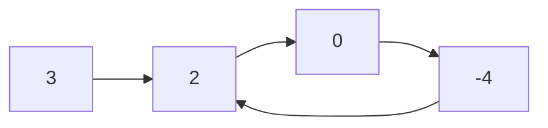

# 41. Linked List Cycle

## Problem

You are given the head of a linked list. Determine whether the list has a cycle in it, meaning some node's `next` pointer eventually loops back to an earlier node instead of reaching `None`.

## Example 1

### Input

```text
head = [3,2,0,-4], the last node's next points back to the node with value 2
```

### Expected Output

```text
true
```

### Explanation

Following `next` pointers from the tail leads back into the list, so it never reaches `None`.

## Example 2

### Input

```text
head = [1,2]
```

### Expected Output

```text
false
```

### Explanation

The list ends normally with the last node's `next` set to `None`, so there is no cycle.

## How to Solve

### Key Idea

Use two pointers moving at different speeds ("Floyd's tortoise and hare"); if there's a cycle, the faster pointer will eventually catch up to the slower one.

### Approach

1. Set `slow` and `fast` pointers both starting at `head`.
2. Move `slow` one step at a time and `fast` two steps at a time, repeating while `fast` and `fast.next` are not `None`.
3. If at any point `slow == fast`, a cycle exists, return `True`; if `fast` reaches the end (`None`), return `False`.

### Why It Works

If there is no cycle, the fast pointer reaches the end first and the loop stops. If there is a cycle, the fast pointer is stuck looping in a bounded region and gains one step on the slow pointer each iteration, so it is guaranteed to eventually land on the same node as slow.

## Visual Explanation



The fast pointer (2 steps) eventually laps the slow pointer (1 step) inside the loop, proving a cycle exists.

## Optimal Solution

```python
class ListNode:
    def __init__(self, val=0, next=None):
        self.val = val
        self.next = next

class Solution:
    def hasCycle(self, head: ListNode) -> bool:
        slow, fast = head, head

        while fast and fast.next:
            slow = slow.next
            fast = fast.next.next
            if slow == fast:
                return True

        return False
```

## Complexity

- **Time:** O(n) — the fast pointer visits at most 2n nodes before either finishing or catching the slow pointer.
- **Space:** O(1) — only two pointers are used, no extra memory.

## Real-World Uses

- Detecting infinite loops in linked data structures like circular buffers or state machines.
- Validating that a dependency graph or pointer chain doesn't loop before processing it.
- Guarding recursive/iterative traversals against corrupted data that creates unintended cycles.

## Key Takeaway

Floyd's cycle detection (slow/fast pointers) detects cycles in linked structures using constant extra space, and is a building block for related problems like finding where a cycle begins.
