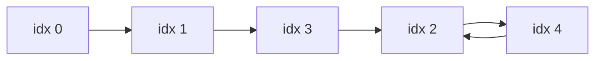

# 42. Find the Duplicate Number

## Problem

You are given an array of `n + 1` integers where every value is between `1` and `n` inclusive. There is exactly one number that repeats (it may repeat more than once), and all other numbers appear exactly once. Find the duplicate number without modifying the array and using only constant extra space.

## Example 1

### Input

```text
nums = [1,3,4,2,2]
```

### Expected Output

```text
2
```

### Explanation

The value 2 appears twice, while 1, 3, and 4 each appear once.

## Example 2

### Input

```text
nums = [3,1,3,4,2]
```

### Expected Output

```text
3
```

### Explanation

The value 3 appears twice, while 1, 2, and 4 each appear once.

## How to Solve

### Key Idea

Treat the array as a linked list where the value at each index tells you which index to jump to next; because a duplicate value exists, this "linked list" must contain a cycle, and finding the cycle's entry point gives the duplicate.

### Approach

1. Define the implicit pointer function `next(i) = nums[i]`. Starting from index 0, use Floyd's slow/fast pointers to detect a cycle, just like in Linked List Cycle.
2. Once `slow` and `fast` meet inside the cycle, reset one pointer to the start (index 0) and keep the other at the meeting point.
3. Move both pointers one step at a time; the index where they meet again is the entry point of the cycle, which is exactly the duplicate number.

### Why It Works

Because values range from 1 to n (never 0), index 0 is guaranteed to not be part of the cycle, and the duplicate value creates two different indices pointing to the same "next" index, which is precisely what forms a cycle. This is the same math as detecting where a cycle begins in a linked list.

## Visual Explanation

Treating `nums = [1,3,4,2,2]` as implicit pointers (`i -> nums[i]`) forms a cycle at the duplicate value:



## Optimal Solution

```python
from typing import List

class Solution:
    def findDuplicate(self, nums: List[int]) -> int:
        slow, fast = 0, 0

        # Phase 1: find the intersection point inside the cycle
        while True:
            slow = nums[slow]
            fast = nums[nums[fast]]
            if slow == fast:
                break

        # Phase 2: find the entrance to the cycle
        slow2 = 0
        while slow2 != slow:
            slow2 = nums[slow2]
            slow = nums[slow]

        return slow
```

## Complexity

- **Time:** O(n) — both phases traverse a bounded number of steps proportional to n.
- **Space:** O(1) — only a couple of index variables are used, and the array is never modified.

## Real-World Uses

- Detecting duplicate/collision entries in hash-based indexes without extra memory.
- Finding repeated identifiers in constrained-memory embedded systems.
- Applying cycle-detection math to non-linked-list problems like function iteration analysis.

## Key Takeaway

Floyd's cycle detection isn't just for linked lists — any array where values act as "next pointers" into itself can be modeled the same way to find cycles in constant space.
