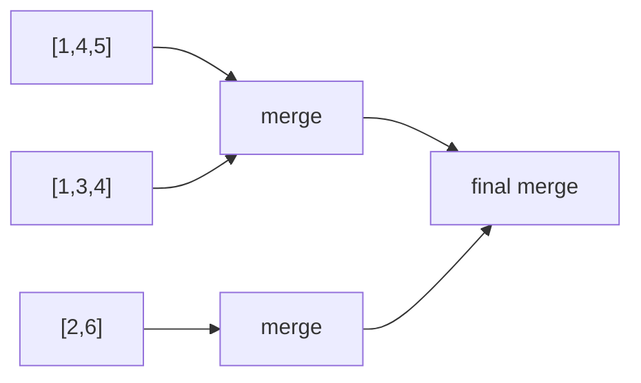

# 44. Merge K Sorted Lists

## Problem

You are given an array of `k` linked lists, each already sorted in ascending order. Merge all of them into a single sorted linked list and return its head.

## Example 1

### Input

```text
lists = [[1,4,5],[1,3,4],[2,6]]
```

### Expected Output

```text
[1,1,2,3,4,4,5,6]
```

### Explanation

All values from the three lists are combined into one fully sorted list.

## Example 2

### Input

```text
lists = []
```

### Expected Output

```text
[]
```

### Explanation

With no lists to merge, the result is an empty list.

## How to Solve

### Key Idea

Repeatedly merge pairs of lists (like in Merge Two Sorted Lists) until only one list remains, which is much faster than merging them one at a time from left to right.

### Approach

1. If the list of lists is empty, return `None`.
2. Merge the lists in pairs: merge list 0 with list 1, list 2 with list 3, and so on, producing half as many lists.
3. Repeat step 2 on the new, smaller set of merged lists until only a single list remains, then return it.

### Why It Works

Merging two sorted lists is efficient (linear in their combined size), and by pairing lists up and halving the count each round, the total work across all rounds stays close to `O(n log k)` instead of the slower `O(n * k)` you'd get from merging one list into the result at a time.

## Visual Explanation



## Optimal Solution

```python
from typing import List, Optional

class ListNode:
    def __init__(self, val=0, next=None):
        self.val = val
        self.next = next

class Solution:
    def mergeKLists(self, lists: List[Optional[ListNode]]) -> Optional[ListNode]:
        if not lists:
            return None

        def merge_two(l1, l2):
            dummy = ListNode()
            tail = dummy
            while l1 and l2:
                if l1.val <= l2.val:
                    tail.next = l1
                    l1 = l1.next
                else:
                    tail.next = l2
                    l2 = l2.next
                tail = tail.next
            tail.next = l1 if l1 else l2
            return dummy.next

        while len(lists) > 1:
            merged = []
            for i in range(0, len(lists), 2):
                l1 = lists[i]
                l2 = lists[i + 1] if i + 1 < len(lists) else None
                merged.append(merge_two(l1, l2))
            lists = merged

        return lists[0]
```

## Complexity

- **Time:** O(n log k) — where n is the total number of nodes across all lists and k is the number of lists; there are log k rounds of merging, each doing O(n) total work.
- **Space:** O(1) extra (not counting the output and recursion-free pairwise merging), or O(k) if you count the list of intermediate merged results.

## Real-World Uses

- Merging sorted log files or shards from distributed systems into one ordered output.
- Combining multiple sorted streams in external sort/merge phases of big-data pipelines.
- Merging paginated, pre-sorted API responses from several services.

## Key Takeaway

Merging in pairs and repeatedly halving the number of lists is a divide-and-conquer trick that turns a slow sequential merge into a much faster logarithmic-round process.
