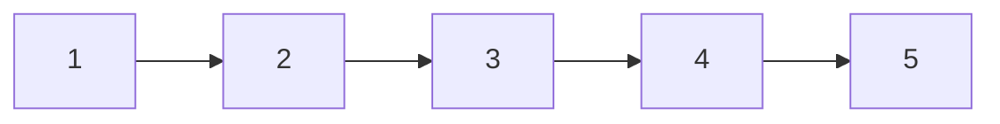
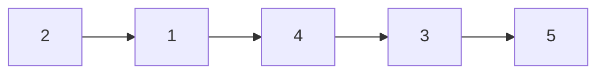

# 45. Reverse Nodes in K-Group

## Problem

You are given the head of a linked list and an integer `k`. Reverse the nodes of the list, k nodes at a time, and return the modified list. If the number of nodes remaining at the end is less than `k`, leave that final group as is (do not reverse it).

## Example 1

### Input

```text
head = [1,2,3,4,5], k = 2
```

### Expected Output

```text
[2,1,4,3,5]
```

### Explanation

The first pair (1,2) and second pair (3,4) are each reversed, but the last single node (5) is left alone since it's fewer than k=2 nodes.

## Example 2

### Input

```text
head = [1,2,3,4,5], k = 3
```

### Expected Output

```text
[3,2,1,4,5]
```

### Explanation

The first group of 3 nodes (1,2,3) is reversed to (3,2,1); the remaining nodes (4,5) are fewer than k=3, so they stay untouched.

## How to Solve

### Key Idea

Process the list group by group: first check if a full group of k nodes exists, and if so reverse just that group, then connect it to the (recursively or iteratively processed) rest of the list.

### Approach

1. Starting from the current position, walk forward k nodes to check whether a full group of k nodes exists; if not, stop and leave the remaining nodes untouched.
2. If a full group exists, reverse just those k nodes using the standard three-pointer reversal, remembering the node right before the group (to reconnect) and the node right after the group (to continue from).
3. Connect the node before the group to the new head of the reversed group, connect the reversed group's new tail to the next unprocessed section, and repeat the whole process starting from that next section.

### Why It Works

Because we always check for a full group of k nodes before reversing, incomplete trailing groups are correctly left alone. Carefully tracking the node before and after each group lets us splice the reversed segment back into the overall list without breaking the chain.

## Visual Explanation

Original list with k=2, grouped in pairs:



After reversing each full group of k:



## Optimal Solution

```python
class ListNode:
    def __init__(self, val=0, next=None):
        self.val = val
        self.next = next

class Solution:
    def reverseKGroup(self, head: ListNode, k: int) -> ListNode:
        dummy = ListNode(0, head)
        group_prev = dummy

        while True:
            # Check if there are at least k nodes left
            kth = group_prev
            for _ in range(k):
                kth = kth.next
                if not kth:
                    return dummy.next

            group_next = kth.next

            # Reverse the group [group_prev.next .. kth]
            prev, curr = group_next, group_prev.next
            while curr != group_next:
                nxt = curr.next
                curr.next = prev
                prev = curr
                curr = nxt

            # Reconnect: group_prev -> kth (new head) ... old head -> group_next
            new_group_head = kth
            old_group_head = group_prev.next
            group_prev.next = new_group_head
            group_prev = old_group_head
```

## Complexity

- **Time:** O(n) — each node is visited a constant number of times across the grouping and reversing steps.
- **Space:** O(1) — the list is reversed in place using only pointers.

## Real-World Uses

- Reversing fixed-size chunks in batch data processing pipelines.
- Implementing block-wise transformations on streamed data (e.g., byte-swap groups in binary protocols).
- Rearranging paginated or chunked UI content in group-wise blocks.

## Key Takeaway

Complex linked list transformations can often be broken into "process one bounded group, then move on to the next group," reusing the basic reversal pattern as a building block.
