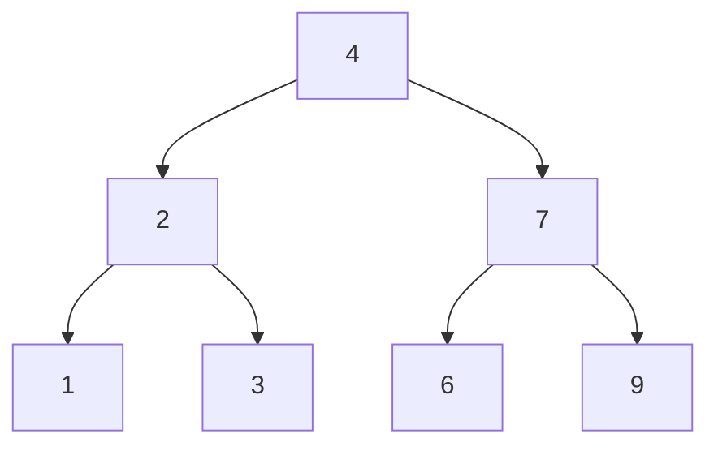

# 46. Invert Binary Tree

## Problem

Given the root of a binary tree, swap the left and right children of every node in the tree, so the whole tree becomes a mirror image of itself. Return the root of the inverted tree.

## Example 1

### Input

```text
root = [4,2,7,1,3,6,9]
```

### Expected Output

```text
[4,7,2,9,6,3,1]
```

### Explanation

Every node's left and right children are swapped, flipping the whole tree left to right.

## Example 2

### Input

```text
root = [2,1,3]
```

### Expected Output

```text
[2,3,1]
```

### Explanation

The left child 1 and right child 3 of the root swap places.

## How to Solve

### Key Idea

For every node, swap its left and right pointers, then do the same thing inside both subtrees.

### Approach

1. If the current node is null, there is nothing to do, so return.
2. Swap the node's left and right children.
3. Recursively invert the left subtree and the right subtree.

### Why It Works

Since every node applies the same swap rule, and recursion handles all nodes down to the leaves, the entire tree ends up mirrored.

## Visual Explanation



Each node swaps its left and right children, mirroring the tree from the root down.

## Optimal Solution

```python
class Solution:
    def invertTree(self, root: TreeNode) -> TreeNode:
        if not root:
            return None

        root.left, root.right = root.right, root.left
        self.invertTree(root.left)
        self.invertTree(root.right)

        return root
```

## Complexity

- **Time:** O(n) — every node is visited once.
- **Space:** O(h) — recursion stack, where h is the tree height.

## Real-World Uses

- Mirroring UI layouts for right-to-left languages by flipping a rendered component tree.
- Flipping image or game-board data structures represented as trees (e.g. board reflections).
- Normalizing tree-shaped data before comparing two structures for symmetry.

## Key Takeaway

This is a classic example of a simple recursive tree pattern: do something at the current node, then recurse on both children.
