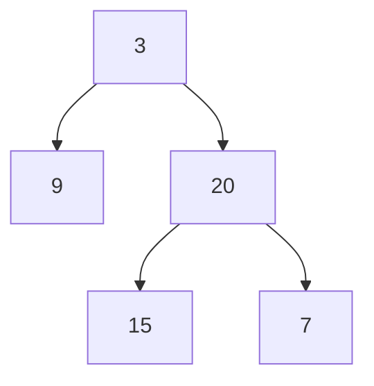

# 47. Maximum Depth of Binary Tree

## Problem

Given the root of a binary tree, find its maximum depth, meaning the number of nodes along the longest path from the root down to the farthest leaf node.

## Example 1

### Input

```text
root = [3,9,20,null,null,15,7]
```

### Expected Output

```text
3
```

### Explanation

The longest path is 3 -> 20 -> 15 (or 7), which has 3 nodes.

## Example 2

### Input

```text
root = [1,null,2]
```

### Expected Output

```text
2
```

### Explanation

The longest path is 1 -> 2, which has 2 nodes.

## How to Solve

### Key Idea

The depth of a tree is 1 (for the current node) plus the larger depth of its two subtrees.

### Approach

1. If the node is null, its depth is 0.
2. Recursively find the depth of the left subtree and the right subtree.
3. Return 1 plus the maximum of those two depths.

### Why It Works

Every node's depth only depends on the deeper of its two children, so combining smaller answers bottom-up gives the correct depth for the whole tree.

## Visual Explanation



Depth is computed bottom-up: leaves return 0, and each ancestor takes 1 + the deeper child's depth.

## Optimal Solution

```python
class Solution:
    def maxDepth(self, root: TreeNode) -> int:
        if not root:
            return 0

        left_depth = self.maxDepth(root.left)
        right_depth = self.maxDepth(root.right)

        return 1 + max(left_depth, right_depth)
```

## Complexity

- **Time:** O(n) — every node is visited once.
- **Space:** O(h) — recursion stack, where h is the tree height.

## Real-World Uses

- Measuring nesting depth of a file-system directory tree or JSON document.
- Estimating call-stack depth for recursive rendering (e.g. nested UI components).
- Checking organizational chart depth to flag overly deep reporting hierarchies.

## Key Takeaway

Many tree problems boil down to "combine the answer from the left subtree and the right subtree" — this is the simplest version of that pattern.
