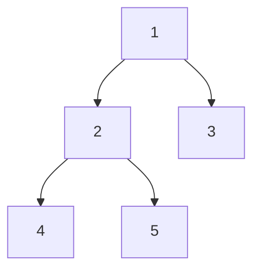

# 48. Diameter of Binary Tree

## Problem

Given the root of a binary tree, find the length of the longest path between any two nodes in the tree, measured by the number of edges. This path may or may not pass through the root.

## Example 1

### Input

```text
root = [1,2,3,4,5]
```

### Expected Output

```text
3
```

### Explanation

The longest path is 4 -> 2 -> 1 -> 3 (or 5 -> 2 -> 1 -> 3), which has 3 edges.

## Example 2

### Input

```text
root = [1,2]
```

### Expected Output

```text
1
```

### Explanation

The longest path is 1 -> 2, which has 1 edge.

## How to Solve

### Key Idea

For every node, the longest path that passes through it equals the height of its left subtree plus the height of its right subtree. Compute heights bottom-up and track the best sum seen so far.

### Approach

1. Write a helper function that returns the height of a subtree.
2. While computing the height, also update a running maximum diameter using left_height + right_height at each node.
3. After the helper finishes, the running maximum is the answer.

### Why It Works

Any path in the tree has a highest node where it "turns" (or a leaf where it starts). At that turning point, the path length equals the sum of the heights of its two subtrees, so checking every node covers every possible path.

## Visual Explanation



Bottom-up: height(4) = height(5) = 1, so height(2) = 2. At node 2, left-height (1) + right-height (1) = 2. At the root (1), left-height (2, from subtree 2) + right-height (1, from leaf 3) = 3 — the largest sum seen, giving diameter 3 for path 4 -> 2 -> 1 -> 3.

## Optimal Solution

```python
class Solution:
    def diameterOfBinaryTree(self, root: TreeNode) -> int:
        self.diameter = 0

        def height(node):
            if not node:
                return 0

            left_height = height(node.left)
            right_height = height(node.right)

            self.diameter = max(self.diameter, left_height + right_height)

            return 1 + max(left_height, right_height)

        height(root)
        return self.diameter
```

## Complexity

- **Time:** O(n) — every node is visited once.
- **Space:** O(h) — recursion stack, where h is the tree height.

## Real-World Uses

- Finding the longest communication path in a network topology modeled as a tree.
- Computing the longest dependency chain in a build/task tree.
- Measuring the "widest" storyline branch in a narrative or decision tree.

## Key Takeaway

Combine two answers (height calculation and diameter tracking) in a single pass instead of recalculating heights repeatedly — this avoids an O(n^2) solution.
