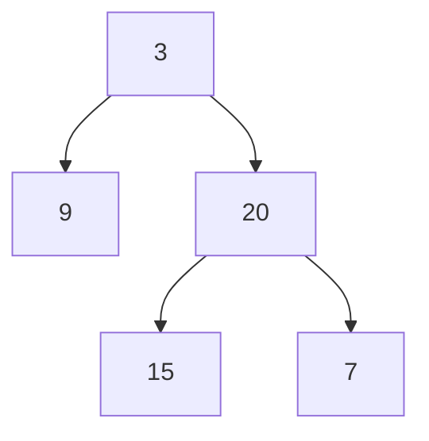

# 49. Balanced Binary Tree

## Problem

Given the root of a binary tree, determine whether it is height-balanced. A tree is height-balanced if, for every node, the height difference between its left and right subtrees is never more than 1.

## Example 1

### Input

```text
root = [3,9,20,null,null,15,7]
```

### Expected Output

```text
true
```

### Explanation

Every node's left and right subtree heights differ by at most 1.

## Example 2

### Input

```text
root = [1,2,2,3,3,null,null,4,4]
```

### Expected Output

```text
false
```

### Explanation

The subtree rooted at node 2 (the second one) has a height difference greater than 1 between its children.

## How to Solve

### Key Idea

Compute the height of each subtree while checking the balance condition at the same time, so you don't need to recompute heights over and over.

### Approach

1. Write a helper function that returns the height of a subtree, or a special "unbalanced" signal if any subtree below it is unbalanced.
2. At each node, get the height of the left and right subtrees using the helper.
3. If either subtree is unbalanced, or the height difference at this node is more than 1, propagate the unbalanced signal upward. Otherwise return 1 plus the max of the two heights.

### Why It Works

By checking the balance condition on the way back up from the leaves (bottom-up), each node is only visited once, and any imbalance found deep in the tree is immediately reported upward without extra recomputation.

## Visual Explanation



Bottom-up: height(9) = 1, and height(15) = height(7) = 1 so height(20) = 2. At the root, left-height (1) and right-height (2) differ by only 1, so every node satisfies the balance condition and the tree is balanced.

## Optimal Solution

```python
class Solution:
    def isBalanced(self, root: TreeNode) -> bool:
        def height(node):
            if not node:
                return 0

            left_height = height(node.left)
            if left_height == -1:
                return -1

            right_height = height(node.right)
            if right_height == -1:
                return -1

            if abs(left_height - right_height) > 1:
                return -1

            return 1 + max(left_height, right_height)

        return height(root) != -1
```

## Complexity

- **Time:** O(n) — every node is visited once.
- **Space:** O(h) — recursion stack, where h is the tree height.

## Real-World Uses

- Validating that a self-balancing data structure (AVL tree, red-black tree) maintains its height invariant.
- Detecting skewed component hierarchies that could cause uneven render or layout costs.
- Auditing organizational hierarchies for lopsided reporting structures.

## Key Takeaway

Use a sentinel value (like -1) returned from the recursion to signal "already found unbalanced" and skip unnecessary work, turning a naive O(n^2) check into an O(n) single pass.
