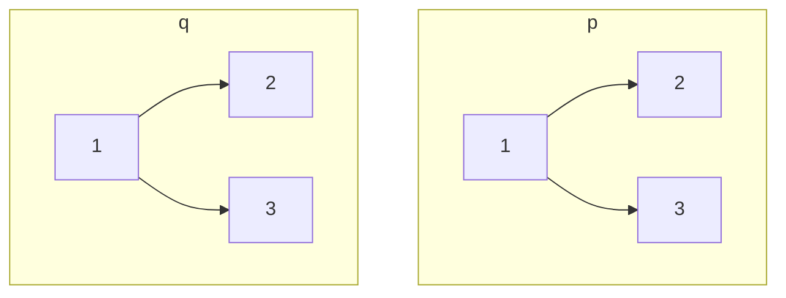

# 50. Same Tree

## Problem

Given the roots of two binary trees, determine whether they are identical, meaning both trees have exactly the same structure and every corresponding node has the same value.

## Example 1

### Input

```text
p = [1,2,3], q = [1,2,3]
```

### Expected Output

```text
true
```

### Explanation

Both trees have the same shape and same values at every position.

## Example 2

### Input

```text
p = [1,2], q = [1,null,2]
```

### Expected Output

```text
false
```

### Explanation

Node 2 is a left child in p but a right child in q, so the structures differ.

## How to Solve

### Key Idea

Two trees are the same only if their root values match and their left subtrees match and their right subtrees match.

### Approach

1. If both nodes are null, they match at this position, so return true.
2. If only one of them is null, or their values differ, return false.
3. Recursively check that the left children match and the right children match, and return true only if both checks pass.

### Why It Works

The recursive check compares every pair of corresponding nodes exactly once. If any pair mismatches (in value or existence), the whole comparison fails; if all pairs match, the trees are identical.

## Visual Explanation



Both trees are traversed in lockstep, comparing corresponding nodes at each position.

## Optimal Solution

```python
class Solution:
    def isSameTree(self, p: TreeNode, q: TreeNode) -> bool:
        if not p and not q:
            return True

        if not p or not q or p.val != q.val:
            return False

        return self.isSameTree(p.left, q.left) and self.isSameTree(p.right, q.right)
```

## Complexity

- **Time:** O(n) — every node in the smaller tree is visited at most once.
- **Space:** O(h) — recursion stack, where h is the tree height.

## Real-World Uses

- Comparing two versions of a document's DOM tree to detect structural changes.
- Diffing abstract syntax trees to check whether two code snippets are semantically identical.
- Verifying that a replicated data structure matches its source after synchronization.

## Key Takeaway

Comparing two trees at the same time (rather than one after another) is a common pattern for structural equality checks.
