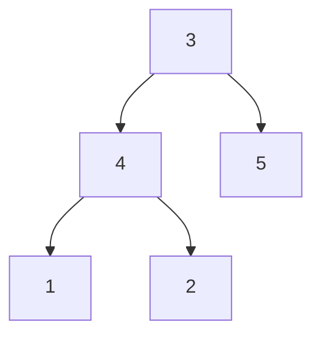

# 51. Subtree of Another Tree

## Problem

Given the roots of two binary trees, root and subRoot, determine whether subRoot appears somewhere inside root as a complete subtree, meaning a node in root together with all its descendants matches subRoot exactly in structure and values.

## Example 1

### Input

```text
root = [3,4,5,1,2], subRoot = [4,1,2]
```

### Expected Output

```text
true
```

### Explanation

The subtree rooted at node 4 in root exactly matches subRoot.

## Example 2

### Input

```text
root = [3,4,5,1,2,null,null,null,null,0], subRoot = [4,1,2]
```

### Expected Output

```text
false
```

### Explanation

The subtree rooted at node 4 in root has an extra node (0), so it does not exactly match subRoot.

## How to Solve

### Key Idea

Walk through every node in root, and at each one, check whether the subtree starting there is identical to subRoot (using a same-tree style check).

### Approach

1. If root is null, subRoot cannot be found, so return false (unless subRoot is also null).
2. Check whether the tree rooted at the current node is exactly the same as subRoot.
3. If it matches, return true. Otherwise, recursively check the left subtree and the right subtree of root.

### Why It Works

Since a subtree match must start at some node in root, checking every node as a potential starting point and comparing the full subtree there guarantees we find a match if one exists.

## Visual Explanation



Starting the same-tree check at node 4 (highlighted subtree) matches subRoot = [4,1,2] exactly.

## Optimal Solution

```python
class Solution:
    def isSubtree(self, root: TreeNode, subRoot: TreeNode) -> bool:
        if not root:
            return subRoot is None

        if self.isSameTree(root, subRoot):
            return True

        return self.isSubtree(root.left, subRoot) or self.isSubtree(root.right, subRoot)

    def isSameTree(self, p: TreeNode, q: TreeNode) -> bool:
        if not p and not q:
            return True

        if not p or not q or p.val != q.val:
            return False

        return self.isSameTree(p.left, q.left) and self.isSameTree(p.right, q.right)
```

## Complexity

- **Time:** O(m * n) — in the worst case, we run the O(n) same-tree check at each of the m nodes in root.
- **Space:** O(h) — recursion stack, where h is the height of root.

## Real-World Uses

- Detecting plagiarized or duplicated code blocks by matching subtrees of an AST.
- Finding whether a UI component pattern occurs elsewhere in a larger component tree.
- Searching for a known configuration fragment inside a larger nested config/JSON tree.

## Key Takeaway

Combining two recursive helpers (one to traverse, one to compare) is a useful pattern when you need to check a condition "starting from every node" in a tree.
