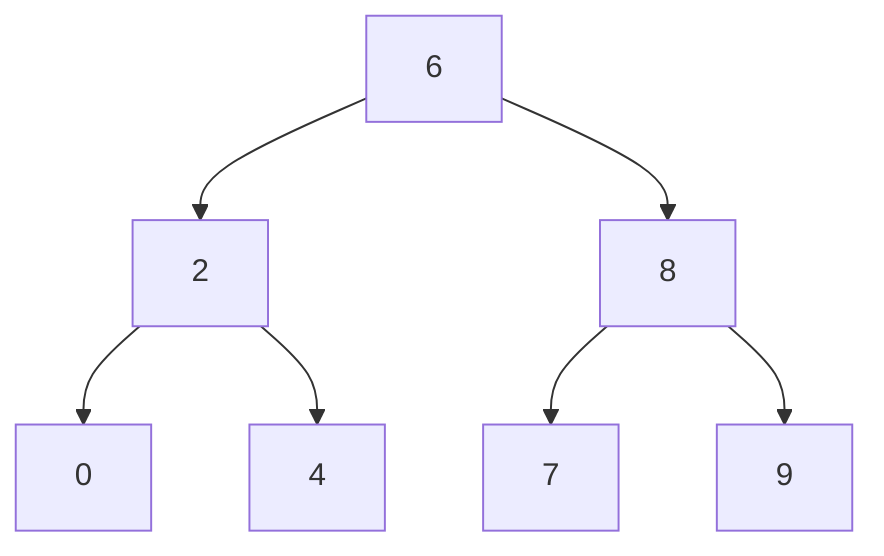

# 52. Lowest Common Ancestor of a Binary Search Tree

## Problem

Given the root of a binary search tree (BST) and two nodes p and q that exist in the tree, find their lowest common ancestor (LCA), meaning the deepest node in the tree that has both p and q as descendants (a node can be a descendant of itself).

## Example 1

### Input

```text
root = [6,2,8,0,4,7,9,null,null,3,5], p = 2, q = 8
```

### Expected Output

```text
6
```

### Explanation

Node 6 is the split point: p (2) is in its left subtree and q (8) is in its right subtree.

## Example 2

### Input

```text
root = [6,2,8,0,4,7,9,null,null,3,5], p = 2, q = 4
```

### Expected Output

```text
2
```

### Explanation

Node 4 is a descendant of node 2, so node 2 itself is the lowest common ancestor.

## How to Solve

### Key Idea

Use the BST ordering property: if both p and q are smaller than the current node, the answer is in the left subtree; if both are larger, it's in the right subtree; otherwise, the current node is the split point and is the answer.

### Approach

1. Start at the root.
2. If both p.val and q.val are less than the current node's value, move to the left child.
3. If both p.val and q.val are greater than the current node's value, move to the right child.
4. Otherwise (values are on different sides, or one equals the current node), the current node is the lowest common ancestor.

### Why It Works

Because of BST ordering, the first node where p and q's paths diverge (one goes left, one goes right, or one of them is the node itself) is exactly the deepest node that is an ancestor of both.

## Visual Explanation



p=2 and q=8 split at node 6: one lands in the left subtree, the other in the right, so 6 is the LCA.

## Optimal Solution

```python
class Solution:
    def lowestCommonAncestor(self, root: TreeNode, p: TreeNode, q: TreeNode) -> TreeNode:
        node = root

        while node:
            if p.val < node.val and q.val < node.val:
                node = node.left
            elif p.val > node.val and q.val > node.val:
                node = node.right
            else:
                return node

        return None
```

## Complexity

- **Time:** O(h) — we walk down one path, where h is the tree height.
- **Space:** O(1) — iterative, no extra space used.

## Real-World Uses

- Finding the common ancestor commit in a version-control branch history.
- Resolving the nearest shared category in a product taxonomy tree.
- Determining the closest common manager of two employees in an org chart.

## Key Takeaway

BST ordering lets you find the LCA without exploring both subtrees — just follow a single path down from the root based on comparisons.
