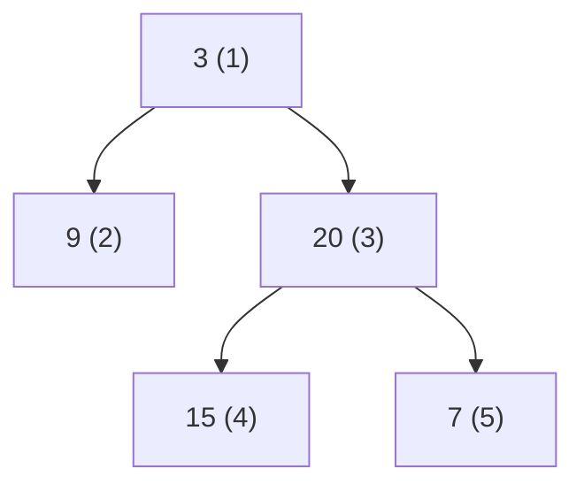

# 53. Binary Tree Level Order Traversal

## Problem

Given the root of a binary tree, return the values of its nodes grouped level by level, from the root level down to the leaf level, with each level's values listed left to right.

## Example 1

### Input

```text
root = [3,9,20,null,null,15,7]
```

### Expected Output

```text
[[3],[9,20],[15,7]]
```

### Explanation

Level 0 has just the root (3), level 1 has 9 and 20, and level 2 has 15 and 7.

## Example 2

### Input

```text
root = [1]
```

### Expected Output

```text
[[1]]
```

### Explanation

There is only one level, containing the root itself.

## How to Solve

### Key Idea

Use breadth-first search (BFS) with a queue, processing the tree one level at a time, and record how many nodes are in each level before moving to the next.

### Approach

1. If root is null, return an empty list.
2. Put the root into a queue. While the queue is not empty, note the current number of nodes in the queue — that is the size of this level.
3. Pop that many nodes, collect their values into a list, and push their children into the queue. Add this level's list to the result, and repeat until the queue is empty.

### Why It Works

A queue processes nodes in the order they were added, which is exactly level order. By snapshotting the queue's size at the start of each round, we know exactly which nodes belong to the current level before their children get mixed in.

## Visual Explanation



BFS visits nodes level by level in the order shown by the numbers, producing [[3],[9,20],[15,7]].

## Optimal Solution

```python
from collections import deque

class Solution:
    def levelOrder(self, root: TreeNode) -> list[list[int]]:
        if not root:
            return []

        result = []
        queue = deque([root])

        while queue:
            level_size = len(queue)
            level_values = []

            for _ in range(level_size):
                node = queue.popleft()
                level_values.append(node.val)

                if node.left:
                    queue.append(node.left)
                if node.right:
                    queue.append(node.right)

            result.append(level_values)

        return result
```

## Complexity

- **Time:** O(n) — every node is visited once.
- **Space:** O(n) — the queue can hold up to a full level of nodes, and the result stores all values.

## Real-World Uses

- Rendering a UI component tree layer by layer (e.g. layout reflow passes).
- Processing an org chart one reporting level at a time for level-based reports.
- Traversing a file-system tree by depth for progressive directory listing.

## Key Takeaway

BFS with a queue, tracking the level size at each step, is the standard pattern for any "process the tree level by level" problem.
