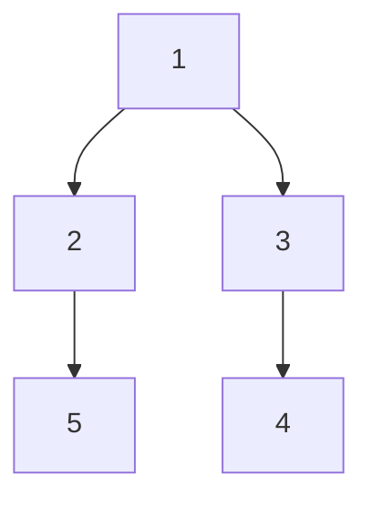

# 54. Binary Tree Right Side View

## Problem

Given the root of a binary tree, imagine standing on the right side of it. Return the values of the nodes you can see, ordered from the top level to the bottom level (that is, the last node visible on each level).

## Example 1

### Input

```text
root = [1,2,3,null,5,null,4]
```

### Expected Output

```text
[1,3,4]
```

### Explanation

From the right side, you see 1 at the top, then 3 (since it's to the right of 2), then 4.

## Example 2

### Input

```text
root = [1,null,3]
```

### Expected Output

```text
[1,3]
```

### Explanation

Each level has only one node, and both are visible from the right side.

## How to Solve

### Key Idea

Do a level order (BFS) traversal, and on each level, keep only the last node's value, since that is the one visible from the right.

### Approach

1. If root is null, return an empty list.
2. Use BFS with a queue, processing one level at a time (just like level order traversal).
3. For each level, after popping all its nodes and pushing their children, record the value of the last node popped in that level as part of the result.

### Why It Works

Within a level, nodes are processed left to right in the queue, so the last one dequeued is the rightmost node on that level — exactly the one visible from the right side.

## Visual Explanation



The last node visited on each BFS level (1, 3, 4) is what's visible from the right side.

## Optimal Solution

```python
from collections import deque

class Solution:
    def rightSideView(self, root: TreeNode) -> list[int]:
        if not root:
            return []

        result = []
        queue = deque([root])

        while queue:
            level_size = len(queue)

            for i in range(level_size):
                node = queue.popleft()

                if i == level_size - 1:
                    result.append(node.val)

                if node.left:
                    queue.append(node.left)
                if node.right:
                    queue.append(node.right)

        return result
```

## Complexity

- **Time:** O(n) — every node is visited once.
- **Space:** O(n) — the queue can hold up to a full level of nodes.

## Real-World Uses

- Generating a silhouette/outline view of a nested UI layout from one side.
- Extracting the "frontier" visible node at each depth in a decision tree for reporting.
- Rendering the rightmost visible branch in a file/folder tree preview.

## Key Takeaway

Level order BFS is flexible: by picking the first or last node processed on each level, you can answer many "what do you see from a certain side" style questions.
