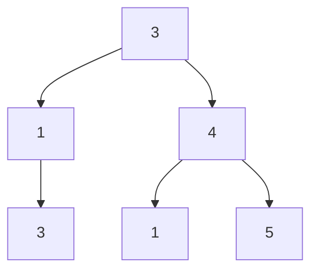

# 55. Count Good Nodes in Binary Tree

## Problem

Given the root of a binary tree, a node is called "good" if the path from the root down to that node contains no value greater than the node's own value. Count and return the total number of good nodes in the tree.

## Example 1

### Input

```text
root = [3,1,4,3,null,1,5]
```

### Expected Output

```text
4
```

### Explanation

The good nodes are 3 (root), 4, 5, and the second 3 — each is at least as large as every value on the path from the root to it.

## Example 2

### Input

```text
root = [1,null,1,null,1]
```

### Expected Output

```text
3
```

### Explanation

Every node has value 1, and since a node only needs to be at least as large as prior values, all three nodes qualify.

## How to Solve

### Key Idea

Walk down the tree while keeping track of the maximum value seen so far on the current path. A node is good if its value is greater than or equal to that running maximum.

### Approach

1. Start a recursive function at the root, passing along the maximum value seen so far on the path (initially negative infinity, or the root's own value).
2. At each node, check if the node's value is greater than or equal to the max-so-far. If so, count it as good.
3. Recurse into the left and right children, updating the max-so-far to be the larger of the current max and the current node's value, and sum up the good node counts from both sides.

### Why It Works

Since we only need the maximum value along the path from the root (not the whole path itself), passing a single running maximum down through recursion is enough to check the "good" condition at every node.

## Visual Explanation



Nodes 3(root), 4, 5, and the second 3 are good since each is >= the max value on its path from the root.

## Optimal Solution

```python
class Solution:
    def goodNodes(self, root: TreeNode) -> int:
        def dfs(node, max_so_far):
            if not node:
                return 0

            count = 1 if node.val >= max_so_far else 0
            new_max = max(max_so_far, node.val)

            count += dfs(node.left, new_max)
            count += dfs(node.right, new_max)

            return count

        return dfs(root, root.val)
```

## Complexity

- **Time:** O(n) — every node is visited once.
- **Space:** O(h) — recursion stack, where h is the tree height.

## Real-World Uses

- Tracking running maximums along approval chains (e.g. spending limits that must never decrease down a hierarchy).
- Validating monotonic thresholds in permission trees (a role's access can't exceed all ancestors').
- Auditing version histories where each release must meet or exceed prior quality gates on its path.

## Key Takeaway

Passing extra information (like a running maximum) down through recursive calls lets you answer path-dependent questions without storing the whole path.
