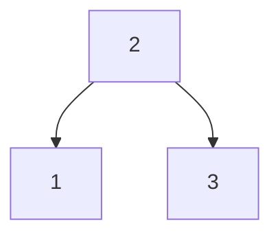

# 56. Validate Binary Search Tree

## Problem

Given the root of a binary tree, determine whether it is a valid binary search tree (BST). In a valid BST, every node's value must be strictly greater than all values in its left subtree and strictly less than all values in its right subtree.

## Example 1

### Input

```text
root = [2,1,3]
```

### Expected Output

```text
true
```

### Explanation

1 < 2 < 3, so every node satisfies the BST ordering rule.

## Example 2

### Input

```text
root = [5,1,4,null,null,3,6]
```

### Expected Output

```text
false
```

### Explanation

Node 4 is in the right subtree of 5, but its left child 3 is less than 5's expected lower bound in that position, breaking the BST rule (3 must be greater than 5 to be valid there).

## How to Solve

### Key Idea

Track a valid (low, high) range for every node as you recurse down. A node must fall strictly within its allowed range, and each child narrows that range further.

### Approach

1. Write a recursive helper that takes a node and the current allowed (low, high) bounds, starting with (-infinity, +infinity) at the root.
2. If the node is null, it's valid (return true). If the node's value is not strictly between low and high, return false.
3. Recurse into the left child with bounds (low, node.val) and the right child with bounds (node.val, high), and return true only if both recursive calls return true.

### Why It Works

Simply checking that a node is greater than its immediate left child and less than its immediate right child is not enough, since a node deep in a subtree must still respect constraints from higher up. Passing down a shrinking valid range enforces the full BST property at every level.

## Visual Explanation



Root starts with range (-inf, +inf). Node 1 (left child) gets range (-inf, 2) and satisfies it; node 3 (right child) gets range (2, +inf) and satisfies it too, so the whole tree is a valid BST.

## Optimal Solution

```python
class Solution:
    def isValidBST(self, root: TreeNode) -> bool:
        def valid(node, low, high):
            if not node:
                return True

            if not (low < node.val < high):
                return False

            return valid(node.left, low, node.val) and valid(node.right, node.val, high)

        return valid(root, float('-inf'), float('inf'))
```

## Complexity

- **Time:** O(n) — every node is visited once.
- **Space:** O(h) — recursion stack, where h is the tree height.

## Real-World Uses

- Validating the integrity of a database index structure built on sorted keys.
- Checking that a sorted-order invariant holds after modifying an in-memory index tree.
- Verifying auto-generated BSTs in testing frameworks before running performance benchmarks.

## Key Takeaway

When a local check isn't enough, pass constraints (like a valid range) down through recursion so every node is validated against the full context of the tree, not just its immediate parent.
